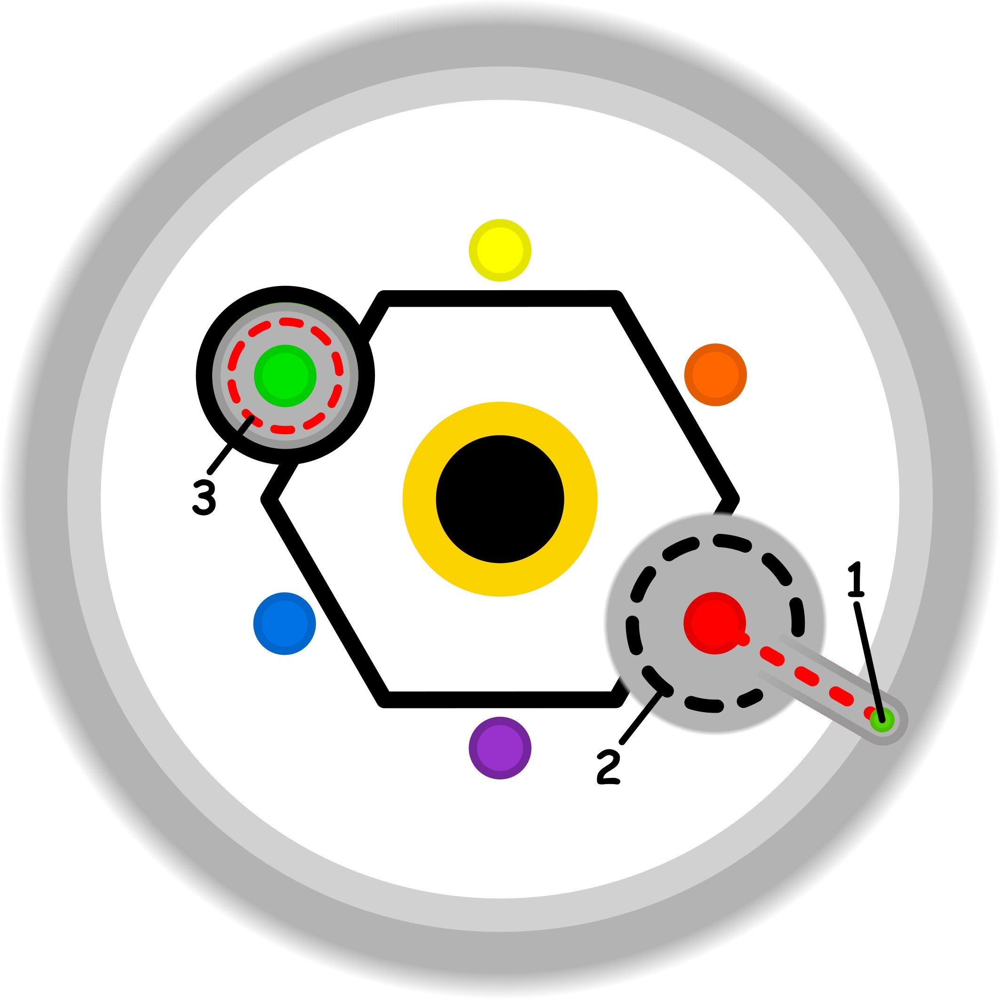

### CONCETTO CHIAVE: 
L'atto di chiedere dissipa la nebbia del "non detto" e della vergogna, trasformando dinamiche relazionali oscure in un terreno solido, trasparente e negoziabile.

### SPIEGAZIONE SIMBOLO:

#### 1. Trigger:
Il punto di innesco risiede nel superamento sistematico dei propri confini personali e dei limiti di sicurezza ragionevoli, manifestandosi quando l'individuo decide di andare oltre la normale partecipazione per inseguire traguardi che eccedono le proprie capacità di recupero. Questo comportamento nasce dalla convinzione che ottenere un risultato aggiuntivo sia prioritario rispetto al mantenimento del proprio equilibrio psicofisico. Tale spinta si traduce nell'accettazione e nella sopportazione di obblighi non necessari, che non derivano da una reale urgenza ma da una ricerca di prestazioni che vanno oltre quanto già ottenuto e ritenuto sufficiente, attivando così una forzatura dei propri ritmi naturali.

#### 2. Situazione Disfunzionale: 
La dinamica problematica si consolida quando lo sforzo occasionale si trasforma in una consuetudine rigida, creando un'abitudine che grava pesantemente sull'identità e sull'integrità del soggetto. In questo scenario, l'intenzione originaria viene compromessa e per essere mantenuta richiede un esercizio puramente forzato della volontà, privo di naturalezza. La "base sicura" dell'individuo è costretta a investire energie e risorse preziose in attività che non generano alcun valore positivo o utilità concreta, ma agiscono come una limitazione indiretta. Questo meccanismo di imposizione interna mina la disponibilità dello scopo, rendendolo frammentato proprio quando servirebbe integrità per agire correttamente.

#### 3. Conseguenze Emotive: 
Sul piano psicologico, l'imposizione di compiti non percepiti come legittimi o necessari genera un profondo senso di rigetto e di rifiuto interiore che si manifesta attraverso emozioni dissonanti. Poiché l'individuo non riconosce una necessità reale o un motivo valido dietro lo sforzo richiesto, l'azione viene vissuta esclusivamente come un obbligo forzoso che non porta a nulla di positivo. Le sensazioni prevalenti sono quelle di una saturazione emotiva che porta al rigetto della situazione, scatenando un conflitto interno tra ciò che si sente di dover fare e la mancanza di senso percepita. Questo stato di tensione costante priva l'individuo della propria libertà d'azione, trasformando l'impegno in una forma di sottomissione psicologica.