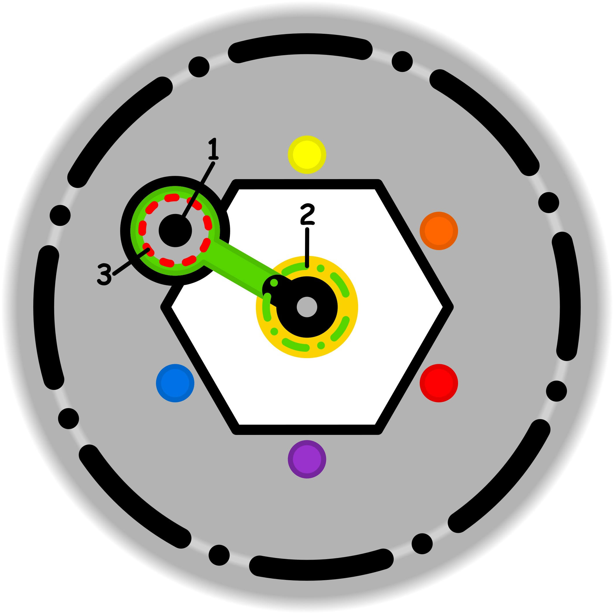

### CONCETTO CHIAVE:
Avere intenzioni prevedibili significa trasformare il "limbo" dell'incertezza in un sentiero solido e graduale, dove il desiderio individuale diventa una proposta chiara, rispettosa e negoziabile per l'altro.

### SIMBOLISMO: 
La scena si svolge sopra un canyon riempito da una nebbia di bolle di sapone iridescenti, che rappresentano i "problemi immateriali" e le paure infondate che nascono dal non detto. Un personaggio (il "Costruttore di Intenzioni") sta creando un ponte verso un'altra figura che attende sul lato opposto. Invece di una struttura rigida, il ponte è fatto di lastre di cristallo fluttuanti e proporzionate, che il Costruttore posa una ad una. Ogni lastra contiene all'interno un ingranaggio o un simbolo luminoso (una clessidra per il tempo, una bilancia per l'equilibrio, una chiave per l'accesso), a simboleggiare che ogni richiesta è chiara, graduale e tiene conto delle necessità dell'altro. L'atmosfera è di calma architettonica che vince sul caos effimero delle bolle.
### PROMPT POSITIVO: 
anime-style illustration, high quality character artwork, detailed eyes, clean line art, cel shading, vibrant colors, professional character illustration, not photorealistic, 2D artwork, illustration, digital artwork, 2D art, stylized, drawn by an artist, not a photograph, not photorealistic, anime rendering, masterpiece, best quality, highly detailed, symbolic surrealism, conceptual art. A vast canyon filled with a dense sea of shimmering, iridescent soap bubbles representing "immaterial problems" and uncertainty. Two figures stand on opposite cliffs. The figure on the left is a "Builder of Intentions," calmly placing glowing, transparent crystalline stepping stones in the air. These stones form a gradual, predictable path across the bubble-filled void. Each stone is etched with golden glowing icons: a balanced scale, a delicate hourglass, and an open hand. The figure on the opposite side watches with a calm, reassured expression as the path approaches. The lighting is a warm, clarifying dawn breaking through a cool mist. Intricate details on the crystals, cinematic composition, metaphorical storytelling, clean lines, ethereal but structured, focus on the bridge of transparency and mutual respect.
### PROMPT NEGATIVO: 
worst quality, low quality, blurry, distorted, literal representation, office meeting, people talking, messy, dark and gloomy, chaotic, disorganized, aggressive, abrupt, leap of faith, opaque, solid stone bridge, lack of detail, watermark, text, signature, low resolution, flat colors, cartoonish, generic fantasy.
### SPIEGAZIONE SIMBOLO:

#### 1. Trigger:
L'elemento scatenante consiste nel tentativo di imporre deliberatamente una condizione di serenità artificiale e non spontanea in contesti dove la tranquillità dovrebbe essere già presente in modo naturale, come all'interno della propria base sicura. Si manifesta attraverso la pretesa di rendere necessaria e forzata un'armonia che, in condizioni normali, sarebbe garantita di default, trasformando un equilibrio naturale in un obiettivo da raggiungere attraverso uno sforzo consapevole e non richiesto. Questo meccanismo di innesco nasce dunque dalla volontà di applicare un riguardo artificioso a situazioni che non ne avrebbero bisogno per funzionare correttamente.
#### 2. Situazione Disfunzionale: 
La dinamica problematica emerge nel momento in cui le necessità individuali vengono trascurate a favore di una presenza inconsapevole e di una spinta interiore di cui non si comprendono appieno le origini. L'individuo agisce mosso da un'indifferenza o dall'incapacità di riconoscere i propri reali bisogni, cercando di applicare all'esterno una stabilità che non riesce a percepire internamente. Questa condizione genera un'incertezza profonda e un'esitazione costante, poiché si tenta di costruire una situazione stabile basandosi sulla preoccupazione e sulla convinzione di dover agire "per forza", privando l'azione di qualsiasi autenticità e stabilità duratura.
#### 3. Conseguenze Emotive: 
A livello emotivo, l'individuo sperimenta una profonda sensazione di forzatura e di obbligo che non proviene da pressioni esterne, ma da vincoli autoimposti inconsapevolmente. Si crea una sorta di "area grigia" interna che segnala una perdita di spontaneità, trasformando l'esperienza in una risposta rigida che mina l'integrità del proprio spazio vitale. Anche se non vi è una compromissione dovuta a fattori ambientali, la persona si sente intrappolata in un circolo vizioso di auto-imposizione, dove il senso di dovere interno agisce come un limite invisibile ma soffocante, impedendo il fluire naturale del proprio essere.