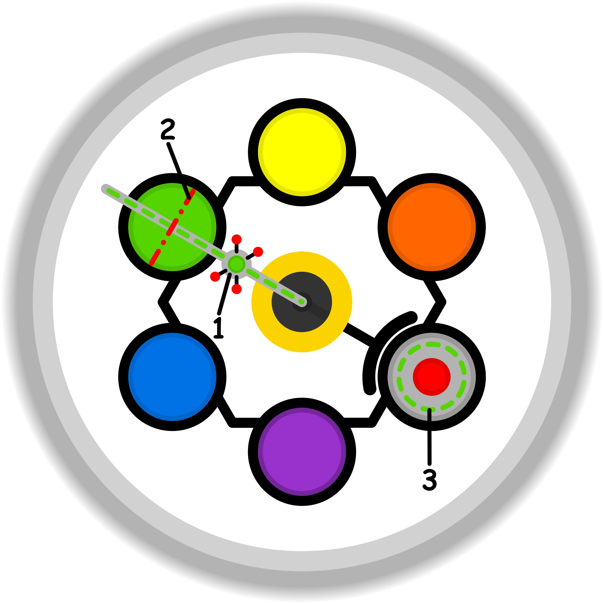

### CONCETTO CHIAVE: 
Il confine sano non come barriera di separazione, ma come punto di convergenza e di equilibrio trasparente per uno scambio etico e mutualmente gratificante.

### SIMBOLISMO: 
La scena trasforma il "confine" in un ponte di luce cristallina sospeso sopra un fiume calmo. Due figure eteree si incontrano al centro, non per scontrarsi, ma per sostenere insieme una bilancia fatta di rami intrecciati e globi luminosi che rappresentano il tempo e le competenze. La trasparenza dell'acqua simboleggia la chiarezza delle intenzioni, mentre i ciottoli luminescenti che segnano il percorso rappresentano le "regole comuni" e le convenzioni stabilite per evitare l'attrito.
### PROMPT POSITIVO: 
anime-style illustration, high quality character artwork, detailed eyes, clean line art, cel shading, vibrant colors, professional character illustration, not photorealistic, 2D artwork, illustration, digital artwork, 2D art, stylized, drawn by an artist, not a photograph, not photorealistic, anime rendering, masterpiece, best quality, highly detailed, ethereal art style, two graceful figures facing each other on a glowing translucent crystalline bridge, a serene twilight landscape in the background, the figures are gently holding a floating golden geometric mandala between them representing equilibrium and mutual exchange, soft golden light emanating from their hands, a clear river flowing beneath the bridge with visible smooth stones on the bottom symbolizing transparency, willow trees with glowing leaves overhanging the water, misty atmosphere, soft focus background, harmonious colors, teal and amber palette, intricate filigree details on the bridge, sense of peace and mutual respect, volumetric lighting, cinematic composition.
### PROMPT NEGATIVO: 
worst quality, low quality, jpeg artifacts, signature, watermark, username, blurry, bad anatomy, bad hands, deformed fingers, wall, fence, barbed wire, conflict, anger, dark shadows, opaque water, imbalance, chaos, sharp edges, aggression, messy, crowded, text, letters, monochrome.
### SPIEGAZIONE SIMBOLO:

#### 1. Trigger:
Il trigger si manifesta come una chiara percezione di disagio o fastidio che emerge proprio sulla soglia di transizione etica dell'individuo. Questo accade tipicamente in presenza di vincoli, siano essi reali o semplicemente percepiti come tali, che si palesano all'interno di quella che dovrebbe essere la propria base sicura. L'elemento scatenante fondamentale è l'inconsapevolezza riguardo al ruolo dello scopo, una mancanza di chiarezza interiore che rende il soggetto permeabile e vulnerabile a sostenere sforzi privi di una reale utilità. Si avverte dunque una frizione interiore nel momento in cui i confini personali vengono sollecitati da pressioni che non trovano una giustificazione consapevole nell'agire.
#### 2. Situazione Disfunzionale: 
La situazione disfunzionale si concretizza nell'incapacità di riconoscere tempestivamente i vincoli e lo sforzo eccessivo a cui si è sottoposti, portando il soggetto a mettere in atto meccanismi di compensazione automatica. Invece di affrontare la radice del problema, si tende a esercitare un controllo ossessivo e una pressione indebita sullo scopo esterno e sulle singole azioni. Questo crea un paradosso in cui ci si ritrova confinati in una zona di apparente comfort che, tuttavia, agisce come una restrizione invisibile. Tale condizione rende sopportabili e occulta dei limiti che dovrebbero invece essere messi apertamente in discussione, permettendo a vincoli impropri di invadere lo spazio privato e minare l'integrità personale.
#### 3. Conseguenze Emotive: 
Le ripercussioni emotive sono caratterizzate da un profondo senso di forzatura e dalla percezione di obblighi pesanti che non trovano una via di espressione o di risoluzione sull'asse dell'azione. L'individuo sperimenta una reazione istintiva di irrigidimento, che si traduce nel bisogno di controllare compulsivamente ciò che sta facendo per gestire la tensione derivante dai vincoli non elaborati. Emerge un vissuto di sopportazione passiva e di confinamento psicologico: nonostante la situazione possa apparire esternamente accettabile, internamente si genera un fastidio persistente. Questa tensione deriva dal conflitto tra il bisogno di un confine sano e la sottomissione a regole che soffocano la spontaneità, impedendo di dissolvere i pesi inutili.