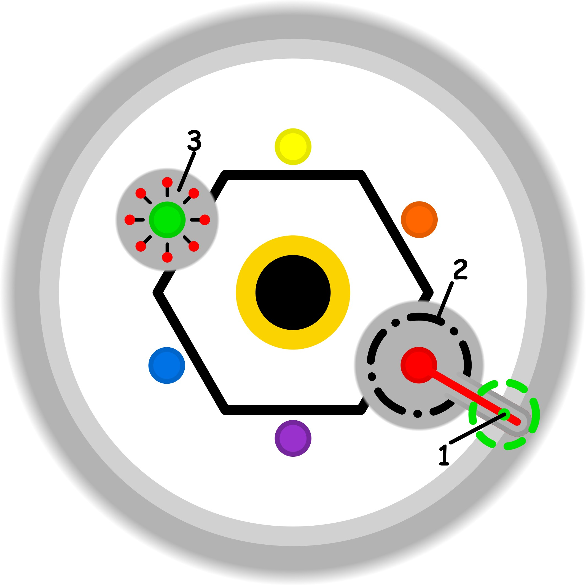

### CONCETTO CHIAVE:
Il passaggio da un ideale eroico astratto e costrittivo alla riscoperta di un'azione spontanea e profondamente sentita.

### SPIEGAZIONE SIMBOLO:

#### 1. Trigger:
L'innesco si realizza nel momento in cui viene varcata la soglia etica personale, superando quel "checkpoint di tranquillità" che garantisce l'equilibrio psicofisico. Questo avviene attraverso uno sforzo attivo e deliberato volto a sovraccaricare lo scopo dell'azione, ignorandone la reale natura e le necessità effettive. Si attiva così una forzatura dei propri limiti in cui non si presta più attenzione a ciò che è realmente necessario o rappresentativo del compito, preferendo invece un'espansione energetica che rompe la naturale armonia dell'agire e della produzione.

#### 2. Situazione Disfunzionale: 
La dinamica problematica si sviluppa in una "zona grigia" di profonda inconsapevolezza, dove l'individuo agisce sotto la spinta di un sacrificio latente che non viene riconosciuto come tale. Si manifesta la figura dell'eroe, che porta il soggetto a percepire come ragionevoli e meritevoli delle lotte e degli sforzi che sono in realtà eccessivi e non giustificati dall'utilità reale del compito. Questo meccanismo di auto-giustificazione serve a nascondere l'eccesso, impedendo di vedere come l'energia venga dissipata in azioni che non spettano alla persona, alimentando un ciclo continuo di impegno forzato e non necessario che viene costantemente giustificato dal merito attribuito all'azione stessa.

#### 3. Conseguenze Emotive: 
Le ripercussioni sul piano emotivo si traducono in un persistente senso di fastidio e in una sensazione estremamente spiacevole di essere oppressi da vincoli indiretti. L'individuo si sente incastrato nel dover assolvere a compiti che non percepisce come propri e che non vorrebbe realmente svolgere, vivendo un perenne stato di sottomissione a obblighi invisibili. La sofferenza è acuita dall'incapacità di individuare con chiarezza la responsabilità o l'origine di tale peso, provocando una sensazione di vincolo latente che impedisce di trovare una risoluzione e di comprendere chi sia il vero responsabile del disagio provato.