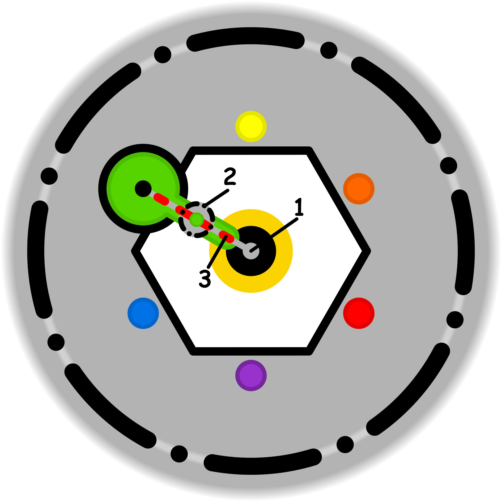

### CONCETTO CHIAVE: 
Disinnescare l'impatto paralizzante dell'incertezza separando il proprio valore personale dagli eventi esterni fuori dal proprio controllo, trasformando il peso del giudizio in un'osservazione distaccata e operativa.

### SPIEGAZIONE SIMBOLO:

#### 1. Trigger:
L'evento scatenante è rappresentato dall'insorgere di un'incertezza impersonale, descritta come un elemento di conflitto interiore o un dubbio non ancora chiarito che esercita un'influenza attiva sul soggetto. Tale incertezza agisce come un trigger psicologico che tende a espandersi e propagarsi, specialmente quando non viene fatta distinzione tra le fonti di dubbio interne e quelle derivanti dall'ambiente esterno. Questa confusione iniziale rappresenta il punto di rottura in cui un'emozione vaga o un conflitto irrisolto iniziano a destabilizzare l'equilibrio interiore della persona, rendendola suscettibile a pressioni ulteriori e alterando la chiarezza necessaria per agire.

#### 2. Situazione Disfunzionale: 
La condizione di disfunzionalità si concretizza quando il sistema di difesa dell'individuo, identificato come una soglia etica poco strutturata o del tutto inconsapevole, non riesce a fungere da barriera protettiva. In questo stato, viene a mancare il sottosistema dell'assertività, rendendo la persona incapace di comunicare i propri bisogni o di manifestare il proprio disagio in modo funzionale e rispettoso verso gli altri. Di conseguenza, si instaura un'assenza di reciprocità nella gestione degli impegni e dello scambio relazionale, aggravata da una generale impreparazione nella tutela dei propri spazi vitali e dalla mancanza di abitudine nel porre limiti chiari, permettendo così all'incertezza di violare i confini personali.

#### 3. Conseguenze Emotive: 
Le ricadute emotive si manifestano sotto forma di una pesante forzatura psicologica, caratterizzata dall'assunzione di obblighi e vincoli che vengono percepiti come vessatori o non necessari rispetto alla realtà dei fatti. Questi vincoli agiscono come conduttori di uno stato d'animo negativo che invade la "base sicura" del soggetto, ovvero quel luogo ideale di stabilità interiore, contaminandolo con elementi di disturbo che ne minano profondamente la serenità. Si instaura così un circolo vizioso alimentato dall'impreparazione nella gestione dei propri spazi, portando l'individuo a vivere in una condizione di oppressione emotiva e di compromissione del proprio benessere, sentendosi prigioniero di vettori psicologici non necessari.