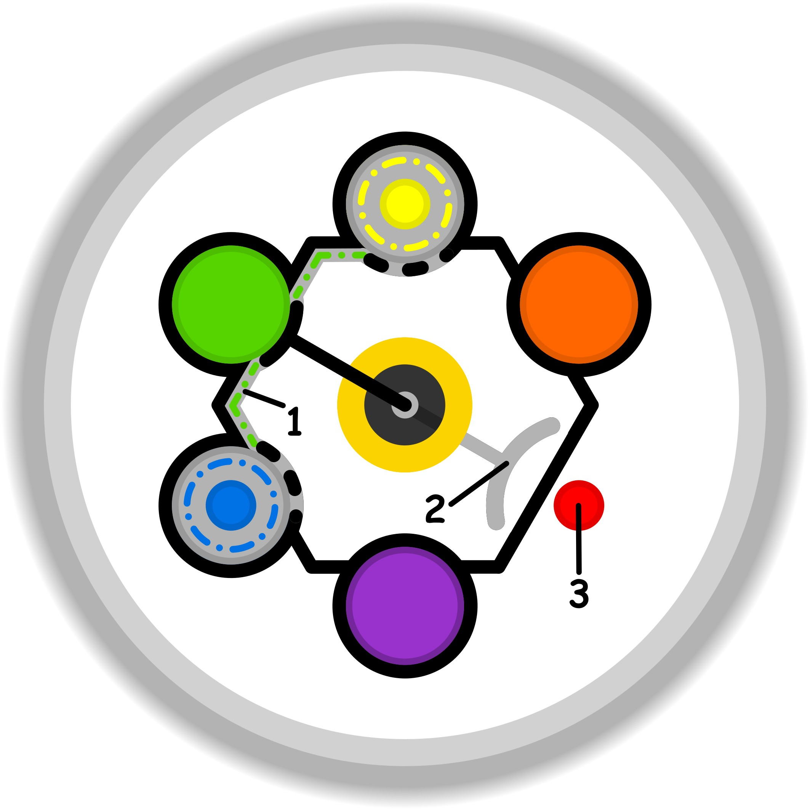

### CONCETTO CHIAVE:
La liberazione dai vincoli delle aspettative e dalla dipendenza dall'esito per permettere a sé e agli altri di agire in totale autonomia e senza colpa.

### SIMBOLISMO:
La scena si svolge in un giardino pensile etereo, sospeso sopra un mare di nuvole, che rappresenta la "sfera interiore" elevata e distaccata dalle pressioni sociali. Il protagonista non è un carceriere che apre gabbie, ma una figura serena che tiene le mani aperte verso l'orizzonte. Da queste mani partivano un tempo dei fili sottili e traslucidi (metafora delle "richieste implicite" e dei vincoli nascosti), che ora si stanno dissolvendo in polvere dorata o trasformando in petali al vento. Gli oggetti circostanti (clessidre che scorrono lente, bussole che non puntano in una direzione fissa) simboleggiano la possibilità di rimandare o dire di no, slegandosi dalla tirannia del tempo e dell'efficacia a tutti i costi. L'atmosfera è di estrema leggerezza, priva del peso del senso di colpa per gli obiettivi disattesi.
### PROMPT POSITIVO:
anime-style illustration, high quality character artwork, detailed eyes, clean line art, cel shading, vibrant colors, professional character illustration, not photorealistic, 2D artwork, illustration, digital artwork, 2D art, stylized, drawn by an artist, not a photograph, not photorealistic, anime rendering, (masterpiece, best quality, ultra-detailed), illustrative style, a serene archetypal figure standing on a white marble terrace floating above a vast ocean of soft clouds, sunset lighting with golden and lavender hues. The figure has open palms facing the sky; hundreds of glowing, thin ethereal threads are fraying and disintegrating into golden butterflies and dandelion seeds, symbolizing the release of expectations and hidden bonds. In the background, ancient clocks and hourglasses are melting or floating away, representing the freedom to wait and choose one's own time. Ethereal atmosphere, sense of profound relief and inner peace, no tension, wide angle, cinematic composition, intricate patterns on the marble, soft focus on the horizon, "offering freedom" concept, dreamlike aesthetic.
### PROMPT NEGATIVO: 
(low quality, worst quality:1.4), (cages, chains, ropes, tangled knots:1.2), dark shadows, heavy atmosphere, prison, walls, grasping hands, tension, stress, anger, crowded, closed spaces, messy lines, distorted anatomy, gloomy colors, sharp metallic objects, industrial setting, guilt, pressure.
### SPIEGAZIONE SIMBOLO:

#### 1. Trigger:
L'innesco del processo avviene attraverso una spinta inconsapevole volta a estendere le proprie necessità personali per sopperire a mancanze o carenze interiori. Questo si traduce nell'impiego di "surrogati" mentali e di abilità che, invece di operare secondo la loro funzione naturale, vengono subordinate alle esigenze di una base sicura instabile. Trattandosi di un'attività non evidente e priva di manifestazioni esterne chiare, risulta estremamente difficile per il soggetto accorgersi di come le proprie risorse cognitive siano state deviate verso scopi puramente compensativi.
#### 2. Situazione Disfunzionale: 
La situazione diventa disfunzionale nel momento in cui l'individuo si trova nell'impossibilità di raggiungere un esito complementare e armonico. Questa condizione è alimentata da un'incertezza che nasce dalla diffidenza circa la disponibilità di risorse reali, portando il soggetto a preferire percorsi indiretti e apparentemente più semplici mediati dai surrogati. Si crea così uno stallo operativo dove, in assenza di uno scopo solido che sostenga l'intenzione, l'azione perde la sua efficacia, intrappolando la persona in una dinamica improduttiva che ostacola il raggiungimento di qualsiasi obiettivo concreto.
#### 3. Conseguenze Emotive: 
Le ricadute emotive sono caratterizzate da un profondo senso di abbandono e da un'invadente percezione di impotenza. Il soggetto vive uno stato di sofferenza legato alla consapevolezza, più o meno latente, che l'utilizzo dei surrogati stia attivamente sottraendo la possibilità di realizzare ciò che desidera veramente. Questo stallo emotivo genera un vissuto negativo in cui l'individuo si sente privo di forza realizzativa, percependo un distacco tra la propria volontà e la capacità di materializzare i propri scopi, portando a una condizione di frustrazione derivante dal fallimento dei propri processi d'azione.