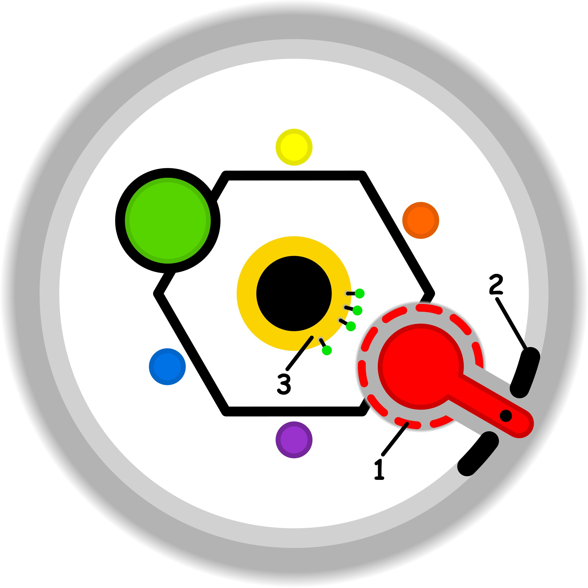

### CONCETTO CHIAVE: 
Il recupero del contatto con la sfera sensoriale e analogica attraverso il rallentamento intenzionale, per trasformare l'approccio volitivo e stressante in un'esplorazione spontanea e priva di giudizio.

### SIMBOLISMO: 
La scena è ambientata in un giardino subacqueo metafisico, dove l'aria è densa come resina trasparente, costringendo ogni movimento a farsi lento, fluido e consapevole. Al centro, un esploratore archetipico (che fonde tratti adulti e infantili) non "afferra" gli oggetti, ma li sfiora con i polpastrelli, rappresentando il contatto "analogico" e primordiale dell'apprendimento. Gli oggetti intorno a lui sono "Esperienze": sfere di cristallo che contengono frammenti di odori, suoni e colori, che egli osserva da lontano prima di avvicinarsi, come un animale curioso ma prudente nel suo territorio. Le clessidre fluttuanti non misurano il tempo, ma sono piene di miele che cola lentissimo, simboleggiando la dilatazione del momento presente. Non c'è una meta visibile: il sentiero è fatto di impronte luminose che appaiono solo dove si posa l'attenzione sensoriale, eliminando l'arroganza della volontà razionale.
### PROMPT POSITIVO: 
anime-style illustration, high quality character artwork, detailed eyes, clean line art, cel shading, vibrant colors, professional character illustration, not photorealistic, 2D artwork, illustration, digital artwork, 2D art, stylized, drawn by an artist, not a photograph, not photorealistic, anime rendering, (masterpiece, best quality, ultra-detailed), illustrative style, a dreamlike underwater-style garden with thick golden atmosphere resembling liquid amber. A serene explorer with a gentle expression is delicately hovering, touching a floating iridescent glass orb with just one finger. The orb is filled with swirling colors and textures representing a "new experience." Around them, giant hourglasses are filled with glowing liquid honey, dripping in slow motion. Bioluminescent plants with velvet textures react to the character's presence. In the background, ghostly outlines of gears and mechanical clocks are crumbling into sand, being replaced by organic, flowing shapes. Soft, warm cinematic lighting, "thick air" effect with floating dust motes like stars, sense of profound calm and sensory immersion, analog textures, wide angle, deep focus on the tactile interaction.
### PROMPT NEGATIVO: 
(low quality, worst quality:1.4), (speed lines, motion blur, racing, clocks with sharp needles, digital displays, binary code:1.2), mechanical, industrial, cold blue lighting, gray, stress, anxiety, aggressive movements, grabbing, punching, running, deadlines, computer parts, rigid geometry, shadows of bars, shouting, overcrowded, chaotic fragments.
### SPIEGAZIONE SIMBOLO:

#### 1. Trigger:
Il trigger si attiva nel momento in cui la forzatura legata al raggiungimento di uno scopo valica la soglia etica individuale, portando a una vera e propria invasione dello spazio personale di libertà. Si tratta di una condizione in cui gli obblighi percepiti o imposti diventano talmente gravosi da mettere seriamente in discussione l'indipendenza del soggetto. Questo innesco non è un evento isolato, ma si configura come una pressione costante che mina la capacità di agire in modo autonomo, creando una frizione insostenibile tra i doveri esterni e il rispetto dei propri confini morali e personali, determinando un'alterazione dell'equilibrio naturale dell'individuo.
#### 2. Situazione Disfunzionale: 
La situazione disfunzionale emerge quando l'individuo opera con limiti personali estremamente fragili o non ben definiti, partecipando in modo del tutto inconsapevole a uno sforzo eccessivo per compiere determinate azioni. Questo meccanismo genera un consumo sproporzionato di risorse interne, poiché il soggetto non si rende conto della quantità di energia che sta applicando nel perseguire un obiettivo. La percezione complessiva è quella di essere letteralmente sommersi da vincoli e pressioni che sembrano arrivare caoticamente da ogni direzione, creando una profonda confusione gestionale che impedisce di riconoscere ed elaborare correttamente gli elementi della propria esperienza.
#### 3. Conseguenze Emotive: 
Sul piano emotivo, il superamento della soglia etica e il costante sforzo inconsapevole generano un profondo senso di fastidio e una pesante sensazione di stagnazione interiore. Questa condizione colpisce la sfera più intima e protetta delle necessità personali, portando l'individuo a sentirsi quasi paralizzato e privo di slancio. Si sperimenta uno stato di immobilità psicologica e di impotenza, derivante dall'incapacità di fronteggiare i molteplici vincoli esterni che premono sul soggetto. Il risultato finale è un vissuto di saturazione in cui l'esperienza vitale sembra fermarsi, lasciando la persona intrappolata in un disagio persistente che impedisce il fluire naturale della propria esistenza.