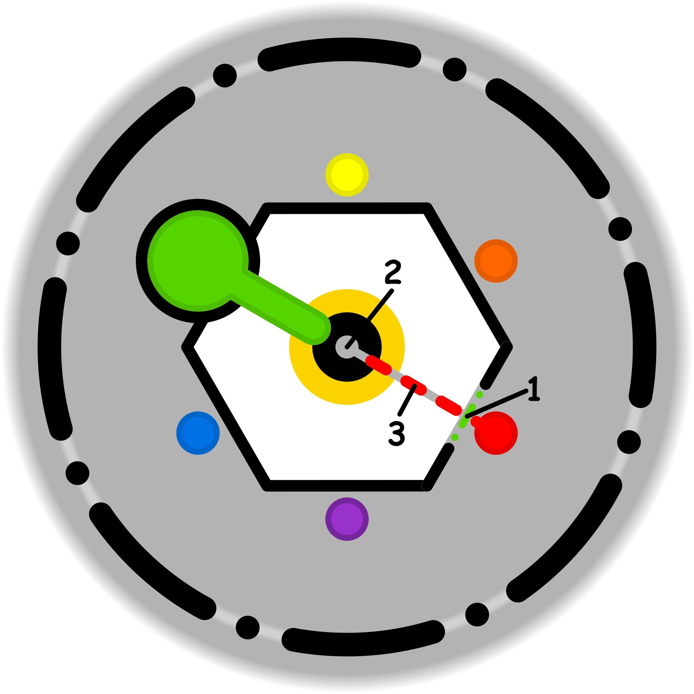

### CONCETTO CHIAVE: 
Riconoscere e bloccare i meccanismi automatici di distrazione che fungono da "scappatoie" per evitare la fatica, preservando l'integrità dell'intento originale attraverso un filtro consapevole.

### SIMBOLISMO: 
La scena ritrae un viaggiatore su un ponte di pietra sospeso sopra un abisso, che rappresenta il sentiero dello sforzo deliberato e dell'impegno. Lungo il ponte, compaiono improvvisamente delle "bolle di miraggio" iridescenti (metafore degli automatismi e dei pensieri estemporanei) che mostrano scene di estremo comfort e banalità domestica: una poltrona morbida, una scrivania ordinata, una tazzina di caffè fumante. Il viaggiatore non entra in queste bolle; invece, utilizza un diario di cristallo fluttuante che funge da "filtro". Con un gesto calmo, egli "cattura" il riflesso della distrazione nel diario (segna l'appunto), trasformando il miraggio in una semplice pagina inchiostrata che smette di brillare e di attrarre. Il ponte è solido e faticoso da percorrere, circondato da un'illuminazione zenitale cruda che simboleggia la chiarezza dell'intento, mentre le distrazioni emettono una luce soffusa e ipnotica.
### PROMPT POSITIVO: 
anime-style illustration, high quality character artwork, detailed eyes, clean line art, cel shading, vibrant colors, professional character illustration, not photorealistic, 2D artwork, illustration, digital artwork, 2D art, stylized, drawn by an artist, not a photograph, not photorealistic, anime rendering, (masterpiece, best quality, ultra-detailed), illustrative style, a lone traveler walking on a narrow, ancient stone bridge over a misty abyss, aiming for a distant radiant peak. Surrounding the traveler are floating, translucent bubbles containing vivid mirages of cozy domestic life (a plush armchair, a steaming cup of tea, a stack of letters). The traveler is holding a glowing crystalline quill, touching a bubble and turning its contents into a flat, monochromatic sketch on a floating parchment, representing "noting the distraction." Intricate stone textures on the bridge, dramatic chiaroscuro lighting, sharp focus on the traveler's determined expression vs. the hazy, ephemeral nature of the bubbles. Cinematic composition, ethereal atmosphere, storytelling through objects, vibrant contrast between the golden path of effort and the pastel hues of the comfort-zone temptations.
### PROMPT NEGATIVO: 
(low quality, worst quality:1.4), (literal office setting, modern computers, cars:1.2), chaos, messy lines, blurry, distorted anatomy, laziness, falling, sleeping, darkness, monochromatic, simple background, ugly, deformed hands, lack of detail, text, watermark, signature.
### SPIEGAZIONE SIMBOLO:

#### 1. Trigger:
L'elemento scatenante, definito come "uno", si identifica con una sorta di cedimento o falla inconsapevole che si apre all'interno della propria soglia etica. Attraverso questa apertura, un'incertezza esterna riesce a penetrare e a mettere radici nelle sfere delle necessità personali, ovvero in quegli ambiti che l'individuo considera fondamentali per il proprio equilibrio e sicurezza. Si tratta di un varco che permette l'intrusione di elementi estranei, i quali, pur non appartenendo realmente ai bisogni autentici del soggetto, iniziano a essere percepiti come essenziali, alterando la percezione di ciò che è effettivamente prioritario e scatenando una dinamica di allerta ingiustificata.
#### 2. Situazione Disfunzionale: 
La situazione problematica si sviluppa quando l'individuo inizia a considerare come vitali e imprescindibili degli elementi o degli obiettivi che normalmente non lo riguarderebbero, portandoli all'interno del proprio sistema di sostegno. Si vengono così a creare delle aspettative estremamente rigide e stringenti riguardo al tipo di supporto che si ritiene necessario garantirsi. Questa dinamica si trasforma in una convinzione profonda, quasi una proiezione del proprio ruolo, che spinge il soggetto a percepire costantemente una mancanza o un vuoto nella propria sfera di necessità. Per colmare questa carenza fittizia, la persona si sente spinta a cercare percorsi obbligatori e forzati per realizzare tali aspettative, ignorando ciò che è realmente utile.
#### 3. Conseguenze Emotive: 
Le ricadute sul piano emotivo si manifestano come una pressione interna costante e incalzante, un vero e proprio obbligo al "fare" che nasce da una convinzione radicata di mancanza. Il soggetto sperimenta uno stimolo potente, descritto come una voce interiore che impone la necessità di provvedere costantemente a bisogni di sostegno che non gli appartengono realmente. Questa condizione genera un vissuto di forzatura, in cui l'individuo insegue un percorso obbligatorio per soddisfare aspettative di supporto che sono diventate sproporzionate rispetto alla realtà. Il risultato è uno stato di tensione psicologica dove l'obbligo di agire prevale sulla spontaneità, portando a una ricerca ansiosa di conferme per colmare lacune percepite come reali ma in realtà estranee.