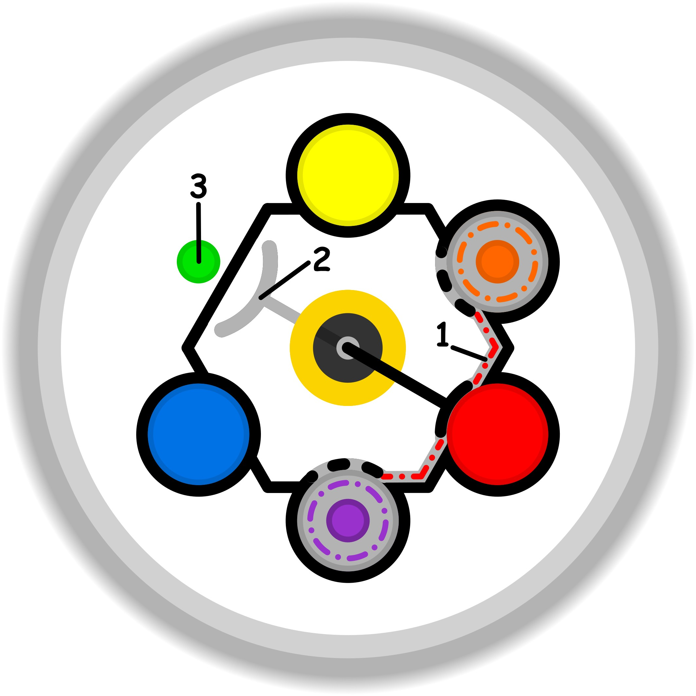

### CONCETTO CHIAVE: 
Sostituire obiettivi rigidi e inamovibili con un "paniere" di alternative equivalenti trasforma il blocco dell'ossessione in un processo esplorativo fluido che garantisce il movimento verso la direzione desiderata.

### SPIEGAZIONE SIMBOLO:

#### 1. Trigger:
Il trigger si identifica in una dinamica di sostituzione e dipendenza inconsapevole, dove il soggetto, non trovando nella propria "base sicura" l'energia necessaria per alimentare i propri scopi, ricorre a dei surrogati. Questi possono riguardare la sfera della spiritualità o dell'intrattenimento e agiscono in modo nascosto, al di sotto della soglia del visibile. Poiché si tratta di bisogni creati autonomamente e di cui non si ha coscienza, il meccanismo rimane coperto da una giustificazione apparente, rendendo estremamente difficile smascherare l'automatismo che spinge a cercare queste alternative invece di affrontare la mancanza reale di energia operativa.

#### 2. Situazione Disfunzionale: 
La situazione disfunzionale si manifesta come un'incertezza cronica nel raggiungimento della propria stabilità e una profonda diffidenza verso le proprie reali opportunità. Questo porta l'individuo ad abbandonare la base sicura e a gestire la realtà in modo precario, accontentandosi di soluzioni di ripiego che servono solo a mitigare temporaneamente il senso di vuoto. Si instaura così un ciclo vizioso in cui non si utilizza più il "complementare" autentico, ovvero ciò che completerebbe davvero l'azione, ma si opera con risorse parziali e non del tutto adeguate. La disfunzione sta proprio in questo accontentarsi della prima opzione disponibile, impedendo la ricerca di soluzioni qualitativamente superiori.

#### 3. Conseguenze Emotive: 
Dal punto di vista emotivo, l'individuo sperimenta un vissuto dominato dal rimpianto e da una costante sensazione di non disponibilità delle risorse necessarie. Emerge il sentimento doloroso di aver perso o abbandonato qualcosa di essenziale lungo il proprio percorso, una consapevolezza latente di non stare vivendo pienamente il proprio scopo. Questa condizione genera una tendenza a cercare sollievo in alternative che facciano "sentire meno la mancanza", ma che non risolvono la sofferenza di fondo. La conseguenza è uno stato di insoddisfazione qualitativa, in cui la persona percepisce il peso di una scelta che non la appaga realmente, restando intrappolata nel rimpianto per ciò che è stato sacrificato in favore del surrogato.