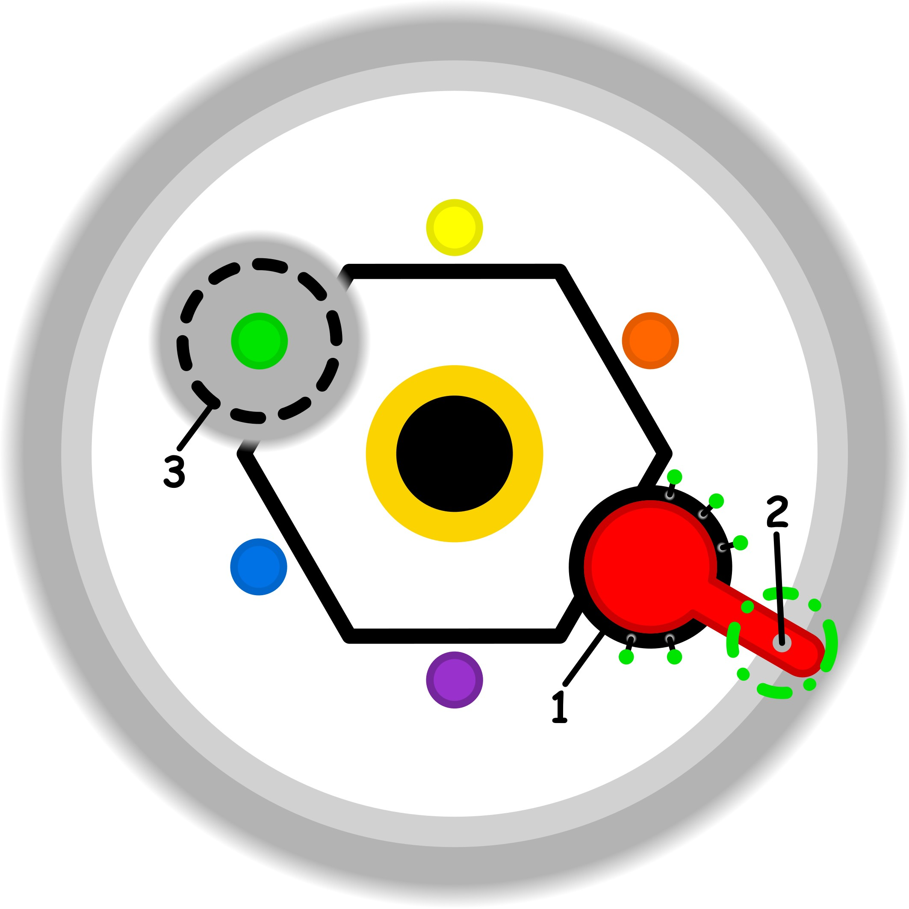

### CONCETTO CHIAVE: 
Il superamento della mentalità del sacrificio attraverso l'alleanza creativa e spontanea con la propria parte interiore più pura e giocosa.

### SPIEGAZIONE SIMBOLO:

#### 1. Trigger:
L'elemento scatenante risiede nel superamento involontario dei propri confini personali e dei limiti di tolleranza psicofisica. Questa violazione si manifesta attraverso la percezione di vincoli impropri che gravano sullo scopo dell'azione, ovvero ostacoli sentiti come estranei, indesiderati e profondamente ingiustificati. Si genera così un'incertezza latente che destabilizza la propria "base sicura", poiché l'individuo avverte la presenza di una frizione o di un attrito che altera la naturale fluidità dell'agire, rendendo il compito non più armonico ma gravato da pesi esterni non riconosciuti.

#### 2. Situazione Disfunzionale: 
La dinamica problematica è alimentata da una profonda inconsapevolezza riguardo all'eccesso di sforzo e al superamento dei propri limiti. In assenza di una chiara comprensione delle cause del logorio interiore, il soggetto entra in una situazione circolare dove le proprie possibilità risultano stagnanti. Per compensare questo squilibrio, si mette in atto un controllo razionale estremo e forzato, nel tentativo disperato di far apparire normale una condizione che è intrinsecamente alterata. Questa incapacità di mappare correttamente i propri stati interni e i propri equilibri fondamentali impedisce una risoluzione autentica, bloccando l'individuo in un loop depotenziante.

#### 3. Conseguenze Emotive: 
Le ripercussioni emotive sono caratterizzate da un senso di fastidio ricorrente e pervasivo che intacca la serenità e la realizzazione dello scopo. Il soggetto vive una sensazione spiacevole di incertezza e di oppressione, derivante dalla percezione di vincoli di cui non si riesce a decifrare la provenienza. Questa stagnazione porta spesso a negare l'esistenza stessa del problema, trasformando il disagio in una condizione cronica che il soggetto non riesce a esprimere o comunicare. L'individuo si ritrova così intrappolato in un vissuto di sofferenza e di attrito costante, perdendo la capacità di individuare correttamente gli elementi necessari al proprio benessere interiore.