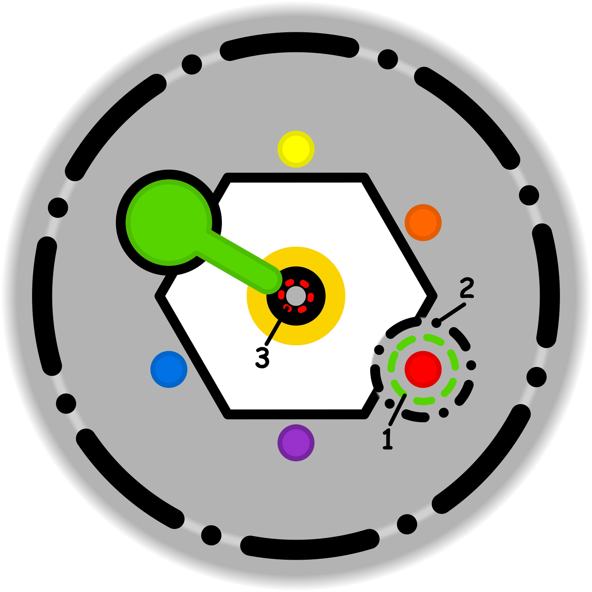

### CONCETTO CHIAVE: 
Dare risalto e onore all'essenziale "nobile" della propria identità, separandolo dal mucchio del superfluo che ne diluisce la potenza evocativa.

### SPIEGAZIONE SIMBOLO:

#### 1. Trigger:
L'innesco del processo avviene quando l'individuo percepisce una forzatura esterna o interna rispetto allo scopo delle proprie azioni, trovandosi in una condizione in cui non si sente libero di rifiutare. Si tratta di una pressione che spinge a compiere attività non gradite o non allineate ai propri desideri, verso le quali non si riesce a esercitare un contrasto efficace o a esprimere un "no" risolutivo. Questo senso di costrizione agisce direttamente sull'intenzionalità del soggetto, trasformando l'impegno in un obbligo percepito come inevitabile e limitando drasticamente la percezione della propria libertà di scelta e di azione.

#### 2. Situazione Disfunzionale: 
La dinamica problematica si consolida quando la soglia etica personale diventa inconsapevole, portando a una progressiva perdita della naturale capacità di assertività. In questo stato, il soggetto finisce per interiorizzare sia le forzature subite sia il contesto e le cause in cui esse avvengono, rendendole parte integrante della propria realtà quotidiana senza riuscire a verbalizzarle o a modificarle. Si crea così una profonda confusione tra ciò che appartiene alla sfera interiore e ciò che viene imposto dall'esterno, impedendo una chiara distinzione tra i propri bisogni autentici e le richieste ambientali che vengono subite passivamente.

#### 3. Conseguenze Emotive: 
Sul piano emotivo, l'interiorizzazione di obblighi non voluti intacca profondamente la serenità individuale e colpisce l'identità nel suo nucleo più intimo. Queste dinamiche assumono la forma di dipendenze occulte che sfuggono al controllo cosciente, generando un malessere persistente dovuto alla trascuratezza di ciò che è realmente importante per la persona. Il risultato è un vissuto caratterizzato da forme di escapismo e da un senso di oppressione, in cui il desiderio di opporsi rimane inespresso, portando a una sofferenza legata al sacrificio di parti essenziali di sé a favore di impegni superflui sentiti come ineludibili.