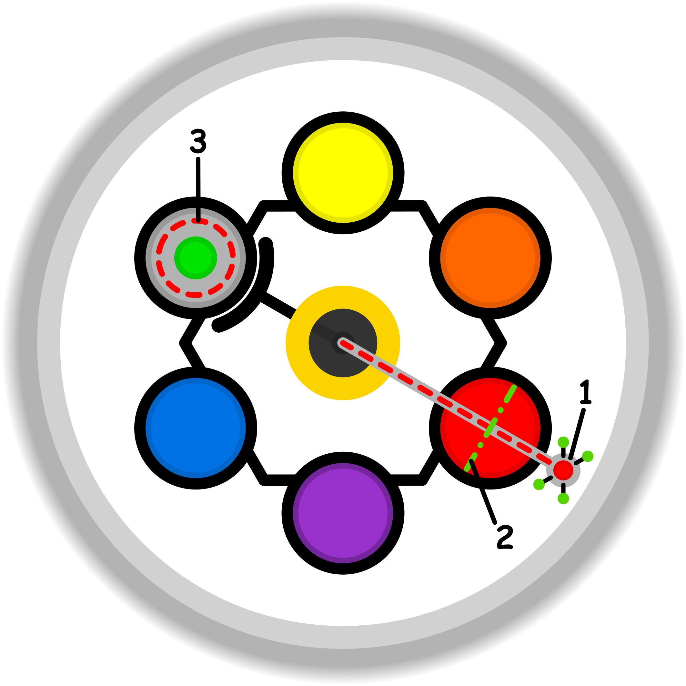

### CONCETTO CHIAVE: 
Il processo di "rompere e ricostruire" non è un atto distruttivo, ma un'opera di restauro selettivo che separa l'essenza nobile dei ricordi e dei legami dalle incrostazioni di abitudini obsolete per restituire loro valore nel presente.

### SPIEGAZIONE SIMBOLO:

#### 1. Trigger:
Il trigger si manifesta come una sensazione di fastidio localizzata nel punto di scambio tra la soglia etica individuale e le sollecitazioni provenienti dall'esterno. Questo segnale di allerta emerge quando il soggetto percepisce una situazione di stagnazione, ovvero una circostanza che non muta e non trova risoluzione, creando una frizione nel punto di incontro tra i propri valori e la realtà circostante. Si tratta di un'irritazione sottile ma persistente che indica come l'equilibrio tra sé e il mondo stia incontrando un ostacolo imprevisto, agendo come il primo campanello d'allarme di un processo di sabotaggio che si attiva proprio sulla soglia dell'attenzione.

#### 2. Situazione Disfunzionale: 
La dinamica problematica si sviluppa a causa di una base sicura inconsapevole che fallisce nel filtrare correttamente le energie dirette verso lo scopo. Questa mancanza di consapevolezza impedisce di riconoscere la necessità di porre dei limiti, portando all'accettazione passiva di obblighi generati dall'esterno che non appartengono alla volontà del soggetto. Tali imposizioni vengono interiorizzate fino a diventare abitudini rigide e inconsce, creando una sorta di consenso forzato che inquina la soglia etica. Si instaura così un circolo vizioso auto-rigenerante in cui l'individuo agisce per puro automatismo, incapace di esprimere le proprie difficoltà e prigioniero di una ciclicità che impedisce ogni reale cambiamento.

#### 3. Conseguenze Emotive: 
Le ripercussioni emotive sono caratterizzate da un vissuto di oppressione derivante da una forzatura psicologica che il soggetto non riesce a contrastare efficacemente. L'individuo sperimenta l'impossibilità di dire di no, sentendosi costretto a sopportare pesi e doveri non propri, il che si traduce in un senso di fastidio profondo e nella rinuncia a manifestare apertamente il proprio disagio. Questa condizione porta a una progressiva erosione della propria integrità, lasciando la persona con una sensazione di "tara" etica permanente e una frustrazione legata al sentirsi intrappolati in una routine priva di autenticità, dove la propria volontà risulta subordinata a dinamiche abitudinarie ormai cronicizzate.