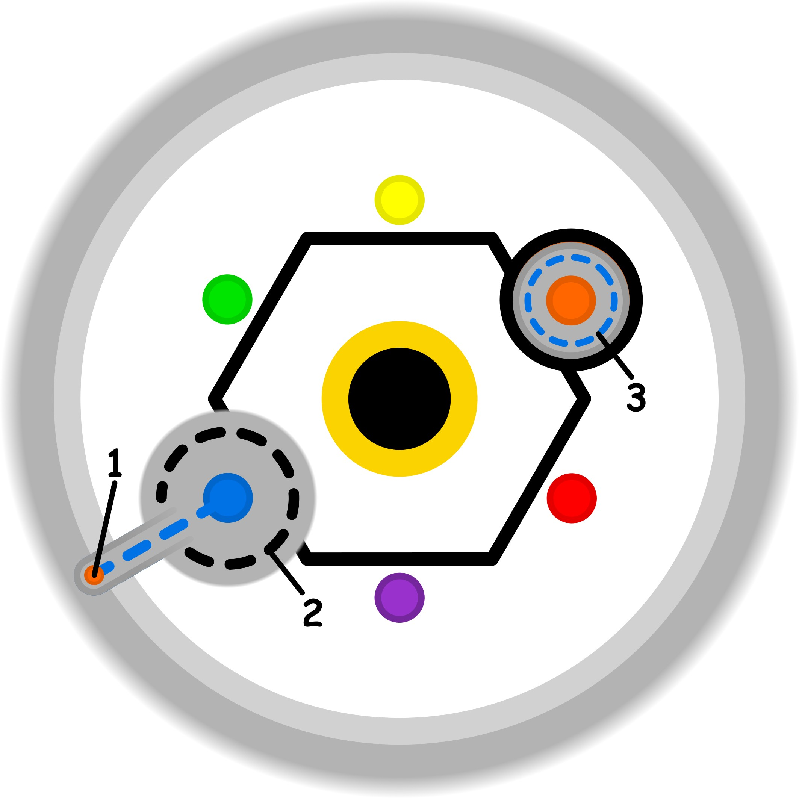

### CONCETTO CHIAVE: 
L’osservazione consapevole dell’incertezza trasforma l’ignoto e l’altro da minaccia allarmante in un fenomeno familiare con cui coesistere, eliminando i filtri distorti della negazione.

### SPIEGAZIONE SIMBOLO:

#### 1. Trigger:
Il punto di innesco si manifesta attraverso il superamento reiterato dei propri confini e limiti personali, spesso in risposta a un significato o valore implicito imposto dall'esterno. Si verifica quando il soggetto accetta una situazione o un concetto nonostante il desiderio interiore di rifiutarli, generando una profonda dissonanza cognitiva. Questa pressione esterna, proposta in modo ostinato, agisce come una forzatura mentale che spinge l'individuo oltre ciò che sarebbe disposto a condividere o accettare, minando la sua capacità di opporre un rifiuto consapevole e coerente con i propri valori.

#### 2. Situazione Disfunzionale: 
La dinamica problematica emerge con la riduzione delle capacità mentali causata dall'incertezza e dalla rigidità dei preconcetti. Il dubbio costante sulla veridicità o sulla rilevanza di quanto imposto crea una pressione indiretta sulla soglia etica, quella barriera che solitamente protegge l'identità e l'integrità della mente. In questo stato, l'intuizione viene sistematicamente bloccata, rendendo il soggetto incapace di agire con chiarezza. L'individuo diventa così vittima di un'ostinazione esterna su concetti che non possono essere ridiscussi, portando a un condizionamento profondo della propria identità e del proprio discernimento.

#### 3. Conseguenze Emotive: 
Le ripercussioni emotive consistono in una forzatura percepita che soffoca la spontaneità e le preferenze personali. Quella che inizialmente era una pressione concettuale esterna si trasforma in un limite interno che impedisce l'espressione naturale del sé. Di conseguenza, l'individuo tende ad assumere atteggiamenti sterili e privi di un reale valore soggettivo, orientandosi verso scelte e comportamenti poveri di significato. Questa condizione riflette un impoverimento dell'esperienza vitale, dove la persona si sente costretta in binari prestabiliti che annullano la vena creativa e la capacità di provare soddisfazione autentica.