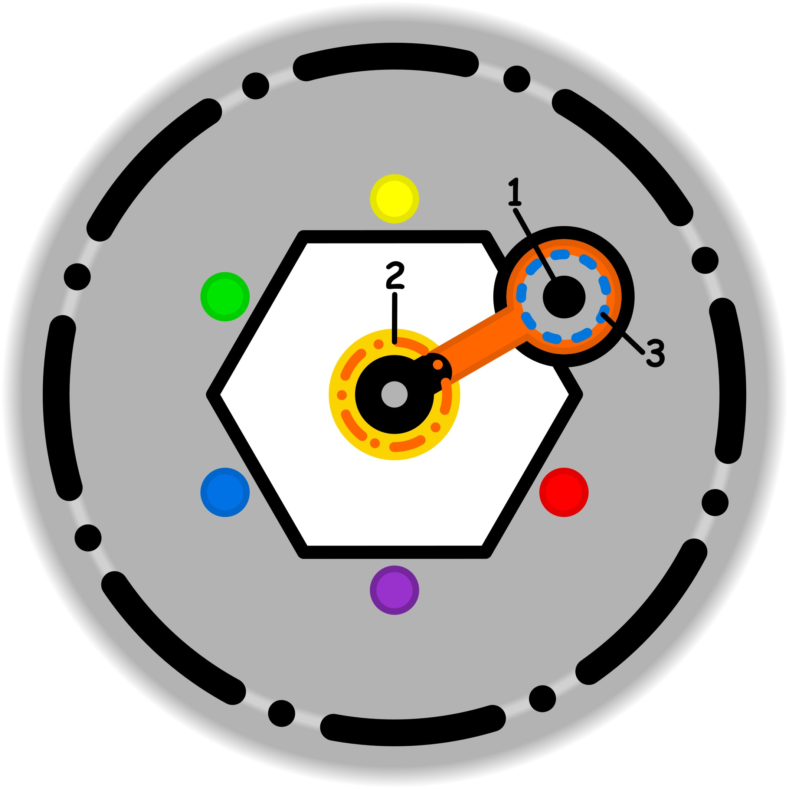

### CONCETTO CHIAVE: 
Aggiornare le vecchie strategie nate dall'urgenza e dalla mancanza di mezzi, integrando la consapevolezza e le abilità attuali per trasformare abitudini critiche in strumenti funzionali e precisi.

### SIMBOLISMO: 
La scena è ambientata in una "officina della memoria" sommersa, dove un mastro artigiano (il sé attuale) sta lavorando su un antico automa meccanico (l'abitudine radicata). L'automa ha parti arrugginite e rozze, forgiate frettolosamente in un momento di necessità (l'urgenza del passato). L'artigiano non distrugge la macchina, ma usa una fiamma azzurra di consapevolezza per dissaldare i vecchi ingranaggi deformati e sostituirli con componenti di cristallo e oro (le nuove competenze e protocolli consapevoli). Intorno, frammenti di specchi mostrano i riflessi dei momenti di crisi passati, ma la luce emanata dai nuovi componenti rende l'ambiente ordinato, calmo e non più dominato dal panico.
### PROMPT POSITIVO: 
anime-style illustration, high quality character artwork, detailed eyes, clean line art, cel shading, vibrant colors, professional character illustration, not photorealistic, 2D artwork, illustration, digital artwork, 2D art, stylized, drawn by an artist, not a photograph, not photorealistic, anime rendering, masterpiece, best quality, highly detailed, symbolic surrealism, conceptual art. A skilled master craftsman in a vast, ethereal underground workshop filled with floating architectural blueprints and glowing gears. The craftsman is meticulously repairing a large, ancient, rusted iron mechanical heart that represents an old habit. He is removing jagged, corroded metal plates and replacing them with intricate, glowing sapphire-glass components and polished gold gears representing "functional updates." A soft, radiant blue light emanates from his hands, symbolizing conscious awareness. In the background, blurry reflections in hanging mirrors show scenes of past storms, contrasting with the current atmosphere of quiet mastery and precision. Cinematic lighting, rich textures of aged rust vs. pristine crystal, storytelling environment, theme of self-evolution and psychological growth, professional composition.
### PROMPT NEGATIVO: 
worst quality, low quality, blurry, distorted, literal representation, destruction, breaking, messy, chaotic, dark and terrifying, modern office, simple background, garbage, junk, broken machines, lack of detail, watermark, text, signature, low resolution, flat colors, cartoonish, generic fantasy, violence, fear.
### SPIEGAZIONE SIMBOLO:

#### 1. Trigger:
L'innesco del processo si verifica nel momento in cui l'individuo tenta di introdurre elementi esterni, indotti o artificiosi all'interno della propria sfera più intima e libera, solitamente dedicata alla creatività e al gioco. Si manifesta come la convinzione errata che sia corretto o necessario inserire parti di un'identità costruita o influenze esterne in uno spazio che dovrebbe rimanere spontaneo. Questo atto di intrusione rompe l'equilibrio naturale della dimensione creativa, segnando l'inizio di una deviazione dai propri bisogni autentici a favore di condizionamenti che non appartengono realmente alla natura profonda del soggetto.
#### 2. Situazione Disfunzionale: 
La condizione problematica si sviluppa attraverso una progressiva e inconsapevole perdita di familiarità con il proprio centro interiore e con il punto più profondo di autorealizzazione. L'individuo, non rendendosi conto dell'impoverimento qualitativo delle proprie necessità, inizia a fare affidamento su surrogati sterili e palliativi esterni, come l'intrattenimento fine a se stesso, per colmare i propri spazi vitali. Questa dinamica erode l'autosufficienza emotiva e creativa, sostituendo la capacità di generare valore interno con un coinvolgimento artificiale che allontana il soggetto dalla propria fonte di felicità autentica e dalla capacità di sentirsi a casa con se stesso.
#### 3. Conseguenze Emotive: 
Sul piano emotivo, l'incapacità di agire in modo autonomo sfocia in una sensazione di forzatura e in un'ostinazione compulsiva volta a compensare il vuoto interiore. Quello che inizialmente era un ricorso inconsapevole a palliativi si trasforma in una necessità apparente e soffocante, che maschera la difficoltà del soggetto di trovare un coinvolgimento positivo e genuino con la realtà. Si instaura così un circolo vizioso di autocompensazione eccessiva, dove la persona si sente spinta a ricercare costantemente stimoli esterni per coprire la mancanza di una connessione autentica con i propri scopi e con la propria capacità di espressione libera.