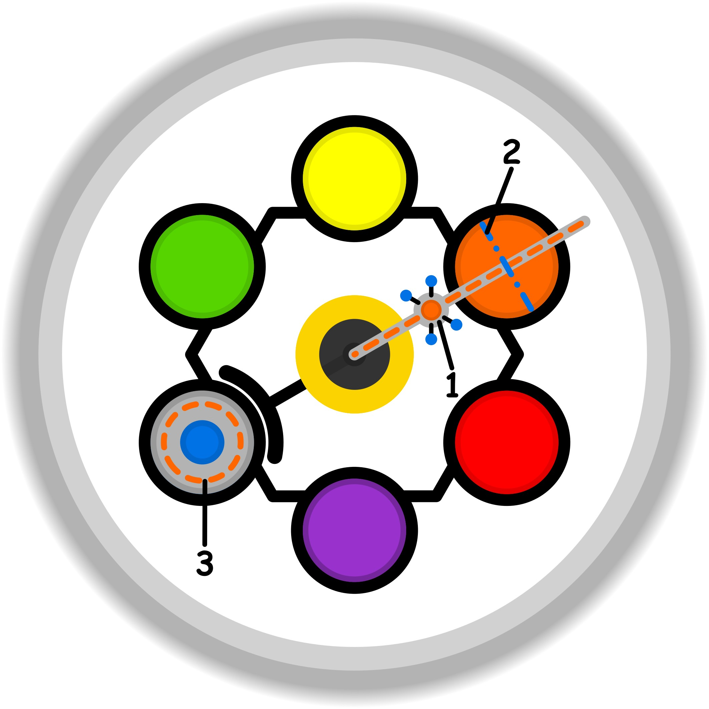

### CONCETTO CHIAVE: 
L'espansione della propria "presenza dinamica" attraverso l'esplorazione curiosa e graduale di nuovi orizzonti, trasformando la rigidità degli schemi abituali in una complicità creativa che rigenera la sensibilità.

### SIMBOLISMO: 
La scena ritrae un "Viandante della Sensibilità" che cammina su un sentiero fatto di vetro trasparente e specchiante, il quale si materializza solo un passo alla volta sopra un abisso di nuvole colorate. Alle sue spalle si trova una città di ingranaggi grigi e rigidi schemi geometrici (la zona di comfort e la prigione mentale), ma ovunque il viandante tocchi il terreno con il suo bastone—una lanterna che proietta frammenti di caleidoscopio—la realtà fiorisce in forme organiche, fluide e vibranti. Questo rappresenta il "recupero della sensibilità" e il "dialogo con la parte che sente". Il viandante non corre, ma avanza con un'espressione di "complicità giocosa", portando con sé una borsa da cui fuoriescono strumenti eterei (la cassetta degli attrezzi ampliata) che infondono colore e vita anche agli oggetti vecchi e neutri che incontra lungo il cammino.
### PROMPT POSITIVO: 
anime-style illustration, high quality character artwork, detailed eyes, clean line art, cel shading, vibrant colors, professional character illustration, not photorealistic, 2D artwork, illustration, digital artwork, 2D art, stylized, drawn by an artist, not a photograph, not photorealistic, anime rendering, masterpiece, best quality, highly detailed, surreal and ethereal art style, a curious explorer walking on a bridge of floating crystalline tiles that form under their feet, the bridge spans between a rigid monochromatic geometric city and a lush bioluminescent garden in the clouds, the explorer holds a glowing prism lantern that casts vibrant rainbow patterns, wherever the light touches the grey environment it transforms into colorful flowers and fluid shapes, sense of "dynamic presence" and joyful curiosity, soft cinematic lighting, volumetric rays, palette of deep teal, violet, and sparkling gold, intricate details of floating gears turning into butterflies, a sense of gradual and peaceful transition, 8k resolution, wide angle.
### PROMPT NEGATIVO: 
worst quality, low quality, jpeg artifacts, signature, watermark, blurry, bad anatomy, stagnation, cage, prison bars, darkness, fear, chaos, sharp aggressive thorns, messy, muddy colors, grey fog, boring, repetitive patterns, sadness, static pose, flat lighting, ordinary street, realistic photography, narrow space.
### SPIEGAZIONE SIMBOLO:

#### 1. Trigger:
L'elemento scatenante si manifesta come un senso di fastidio e irritazione che affiora in momenti specifici della quotidianità, agendo sulla soglia di comunicazione tra la propria etica e il mondo interiore. Questo innesco è strettamente legato all'incontro con pregiudizi e condizionamenti esterni che vengono percepiti come giudizi sulla propria persona. Non è rilevante l'intenzionalità di chi trasmette tali pregiudizi; ciò che conta è l'impatto di questa valutazione esterna che, insinuandosi nel vissuto del soggetto, attiva una reazione di disagio immediata, segnalando una frizione tra la propria natura e le aspettative sociali percepite.
#### 2. Situazione Disfunzionale: 
La dinamica problematica si sviluppa in una cornice di scarsa consapevolezza, dove l'individuo inizia a nutrire dubbi profondi sulla legittimità dei propri desideri e delle proprie capacità espressive. Si instaura un clima di insicurezza in cui il soggetto si interroga se le proprie azioni siano superflue o meritevoli di essere portate avanti, finendo per soppesare eccessivamente ogni iniziativa. Il contesto circostante viene vissuto come inadeguato o ostile a causa dell'influenza del giudizio altrui, reale o presunto, che blocca la libera espressione del sé. Questa incertezza impedisce di agire con spontaneità, trasformando il desiderio di manifestarsi in un conflitto tra l'intenzione interna e il timore del vaglio esterno.
#### 3. Conseguenze Emotive: 
Le ricadute sul piano emotivo si manifestano attraverso un meccanismo di compensazione forzata che può degenerare in condotte di abuso o eccesso. Il soggetto, sentendosi inibito nelle aree soggette a giudizio, riversa un interesse sproporzionato su attività ritenute "sicure" o legittime, usandole come valvole di sfogo per la propria sofferenza repressa. Questo spostamento di energie funge da anestetico per non avvertire il dolore derivante dalla mancata espressione di sé, creando un circolo vizioso che assume i tratti di una vera e propria ripicca psicologica. L'emotività risulta così frammentata, divisa tra la soggezione verso il giudizio esterno e una ricerca esasperata di sollievo in ambiti che diventano, paradossalmente, una nuova prigione comportamentale.