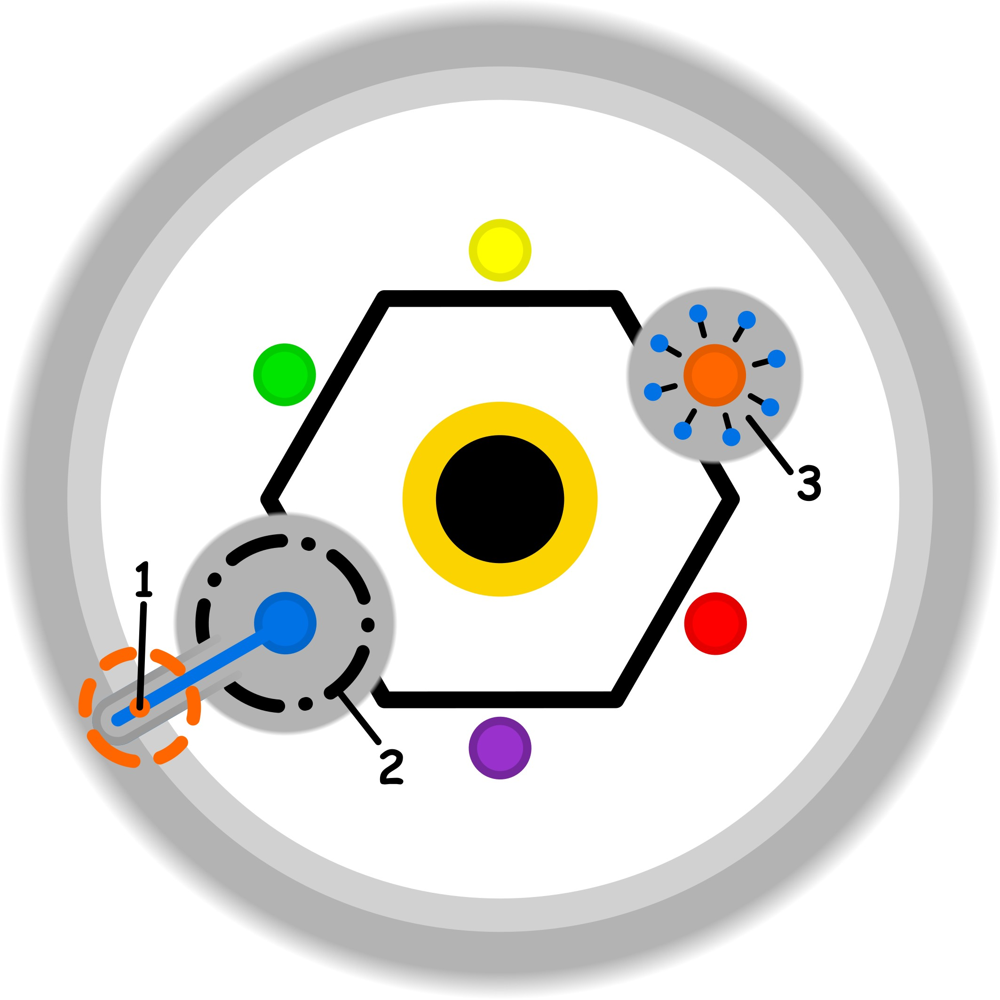

### CONCETTO CHIAVE: 
Trasformare gli automatismi rigidi e reattivi in abitudini sartoriali e gratificanti, dove l’azione non è più un compito da sbrigare ma un’espressione di piacere e maestria personale.

### SPIEGAZIONE SIMBOLO:

#### 1. Trigger:
Il momento di innesco si colloca esattamente sulla soglia etica dell'individuo, ovvero in quel punto critico di transizione verso l'interazione con la dimensione sociale. Questo passaggio è caratterizzato da una percezione di forzatura e dalla presenza di eccessi nelle dinamiche relazionali esterne, i quali inducono una condizione di incertezza stagnante. Tale pressione sociale agisce come uno stimolo che destabilizza il confine tra l'io e il mondo, introducendo elementi di confusione che non permettono una navigazione fluida e serena dei propri spazi identitari e dei processi decisionali.

#### 2. Situazione Disfunzionale: 
La dinamica disfunzionale si sviluppa quando l'individuo, nel tentativo di compensare gli eccessi dell'area sociale, impone a se stesso regole estremamente rigide e stringenti. Questo approccio crea un paradosso dove la necessità di controllo porta a trascurare la protezione della propria soglia etica, indebolendo la difesa dell'identità personale e dell'intuizione naturale. In questo contesto, il soggetto smette di mettere in discussione il dubbio, accettandolo passivamente e alimentando una dipendenza circolare che si autorigenera costantemente, impedendo il ripristino di un equilibrio funzionale tra le diverse componenti della propria vita.

#### 3. Conseguenze Emotive: 
Le ripercussioni emotive si manifestano principalmente attraverso un senso di fastidio persistente, spesso alimentato dalla percezione di un pregiudizio nell'ambiente circostante. Tale stato d'animo agisce come un limite invalicabile che compromette la capacità dell'individuo di vivere con pienezza e di godersi il momento presente. Per tentare di recuperare l'equilibrio perduto tra i propri ruoli complementari, il soggetto viene spinto verso una ricerca compulsiva di fonti di intrattenimento o situazioni distraenti. Queste ultime finiscono spesso per generare nuovi eccessi, consolidando una dinamica di sofferenza e dipendenza che impedisce la reale riconnessione con il proprio benessere interiore.