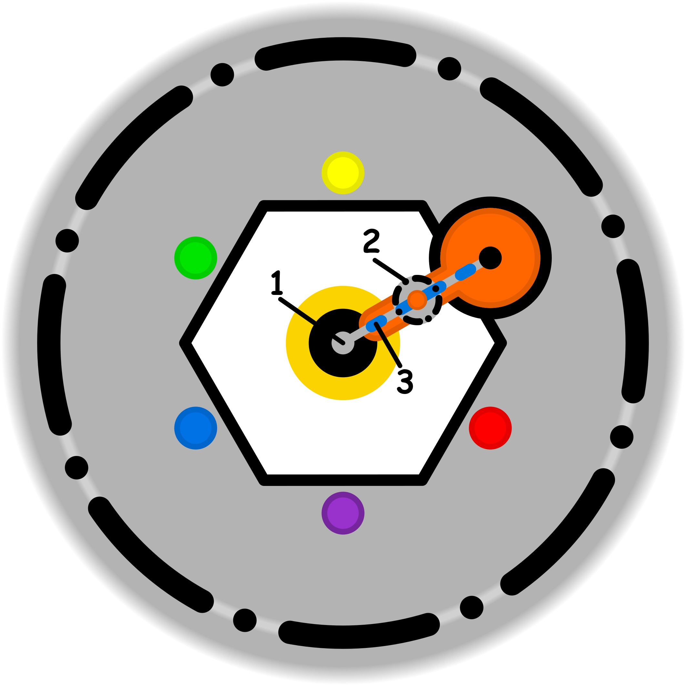

### CONCETTO CHIAVE: 
La separazione consapevole dall'eco dei fallimenti passati per riabilitare la sensibilità intorpidita e ridare ali alla propria creatività.

### SIMBOLISMO: 
Una soffitta dell'anima, vasta e polverosa, dove il tempo sembra essersi fermato in una perenne penombra grigia. Al centro, una figura archetipica (il "Restauratore") regge una lanterna di pura luce dorata, che rappresenta la consapevolezza presente. Dove la luce tocca gli oggetti – vecchi sogni simili a statue di pietra o strumenti musicali incrostati di ghiaccio – la materia si trasforma: le ali di una statua iniziano a battere diventando piume reali, e da un vecchio libro dimenticato sgorgano fiumi di colore vivido che ridipingono l'ambiente. Il passato è rappresentato da pesanti catene di nebbia che si dissolvono al contatto con il calore della lanterna.
### PROMPT POSITIVO: 
anime-style illustration, high quality character artwork, detailed eyes, clean line art, cel shading, vibrant colors, professional character illustration, not photorealistic, 2D artwork, illustration, digital artwork, 2D art, stylized, drawn by an artist, not a photograph, not photorealistic, anime rendering, masterpiece, best quality, highres, conceptual art, surrealism, narrative storytelling, a mystical attic of memories, a central figure holding a glowing golden lantern of "awareness", warm light vs cold shadows, cinematic lighting, stone wings of a statue turning into real soft feathers, vibrant liquid colors flowing out of an old dusty book, frozen gears starting to turn, dust motes dancing in sunbeams, transition from monochrome grey to vivid saturated colors, ethereal atmosphere, intricate textures of cracked stone and aged wood, symbolic transformation, hope and healing, hyper-detailed environment, magical realism.
### PROMPT NEGATIVO: 
low quality, worst quality, text, watermark, signature, blurry, distorted, messy, dark, gloomy, sadness, depression, literal office, modern furniture, business suit, tools, hammer, industrial setting, realistic human face, photography, low resolution, simple background, static scene, violence, aggressive colors.
### SPIEGAZIONE SIMBOLO:

#### 1. Trigger:
L'innesco del processo risiede nella comparsa di un'incertezza interiore non risolta che agisce come un elemento di disturbo e distrazione. Tale sensazione vaga altera la naturale predisposizione creativa dell'individuo, compromettendo l'approccio ludico e spontaneo verso le proprie attività. Poiché questa incertezza genera un vissuto spiacevole, il soggetto tende istintivamente a ignorarla, evitando di soffermarsi a chiarirne l'origine o il significato profondo. Questa fuga dalla sensazione sgradevole impedisce di affrontare il nucleo del dubbio emergente, spostando l'energia verso una ricerca di distrazione che destabilizza l'equilibrio interiore.
#### 2. Situazione Disfunzionale: 
La dinamica disfunzionale si stabilizza quando la gestione della propria soglia etica avviene in modo inconsapevole, impedendo di mantenere la necessaria semplicità nell'agire. Invece di accogliere il dubbio con naturalezza, si attiva un meccanismo di ostinazione forzata che spinge l'individuo a voler risolvere l'incertezza a ogni costo. Si viene così a creare un circolo vizioso auto-rigenerante in cui il tentativo di compensare la mancanza di chiarezza alimenta un'ulteriore forzatura. Questa rigidità rende impossibile un approccio gentile verso se stessi, trasformando l'azione in un'imposizione che preclude ogni forma di esplorazione libera e progressiva.
#### 3. Conseguenze Emotive: 
Le ripercussioni sul piano emotivo si manifestano come un fastidio interiore persistente e una profonda frustrazione derivante dall'incapacità di gestire il conflitto in modo funzionale. Il soggetto vive una condizione di forzatura ostinata che preclude la possibilità di agire seguendo un metodo graduale e ludico, dove l'errore sarebbe considerato una parte accettabile del percorso. La perdita di questa dimensione flessibile genera un vissuto spiacevole, caratterizzato da un'oppressione psicologica che soffoca la spontaneità. L'individuo si ritrova così intrappolato in una spirale di insoddisfazione, sentendosi privato della libertà di sperimentare e della gratificazione derivante dal gioco creativo.