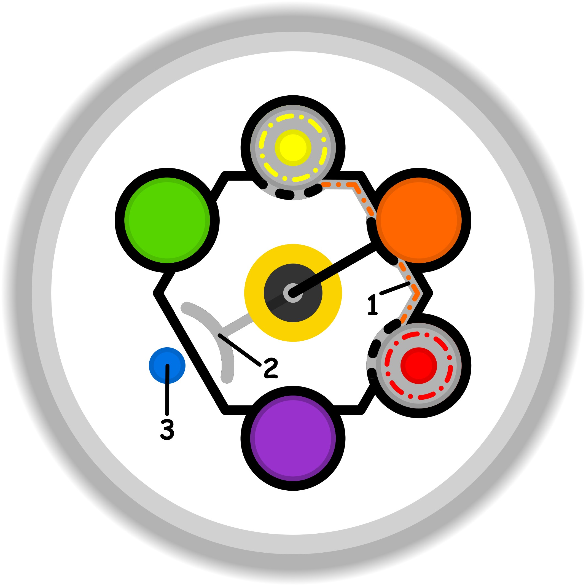

### CONCETTO CHIAVE: 
Trasformare il cambiamento da ostacolo faticoso a progresso naturale attraverso la preparazione metodica e la creazione di una "strada in discesa" che faciliti l'azione per sé e per gli altri.

### SPIEGAZIONE SIMBOLO:

#### 1. Trigger:
L'innesco si identifica in una ricerca inconsapevole di compensazione attraverso l'uso di palliativi, che emerge quando l'individuo si rifiuta di riconoscere i propri dubbi o l'incapacità di risolvere un problema a livello cognitivo. Invece di affrontare l'incertezza nel suo campo d'azione naturale, ovvero la mente, si tenta di forzare una soluzione esterna basata su tentativi pratici, sull'esercizio di abilità tecniche o su un'insistenza ostinata verso il raggiungimento dello scopo. Questa dinamica nasce dall'impossibilità di gestire il dubbio in modo consapevole, portando a una sostituzione della riflessione con azioni non ideali e prive di un reale fondamento mentale.

#### 2. Situazione Disfunzionale: 
La condizione problematica è definita da un accesso rigido e forzato alla complicità che dovrebbe intercorrere tra la mente e la dimensione del gioco. La mente, per operare al meglio delle proprie potenzialità, necessita di un ambiente semplice e accessibile, ma quando questo equilibrio viene meno, subentra uno stato di abbandono che si manifesta sotto forma di disinteresse. Tale distacco allontana progressivamente il soggetto dal desiderio di comprendere o interagire correttamente con il fenomeno che intende esplorare, bloccando la disponibilità della mente a gestire la situazione e rendendo l'intera attività priva di fluidità e di coerenza operativa.

#### 3. Conseguenze Emotive: 
Sul piano emotivo, il venir meno della sinergia funzionale porta allo svuotamento di significato e alla perdita del piacere individuale in ciò che si sta cercando di realizzare. L'attività, che originariamente avrebbe dovuto essere piacevole e significativa, si trasforma in un elemento spiacevole che chiude un cerchio vizioso di insoddisfazione. Il soggetto sperimenta un profondo senso di distacco e una mancanza di coinvolgimento genuino, poiché la dimensione ludica e creativa viene del tutto sacrificata. Questo stato di disagio, derivante dall'incapacità di agire con semplicità, trasforma l'impegno in un peso che alimenta ulteriormente la volontà di abbandono.