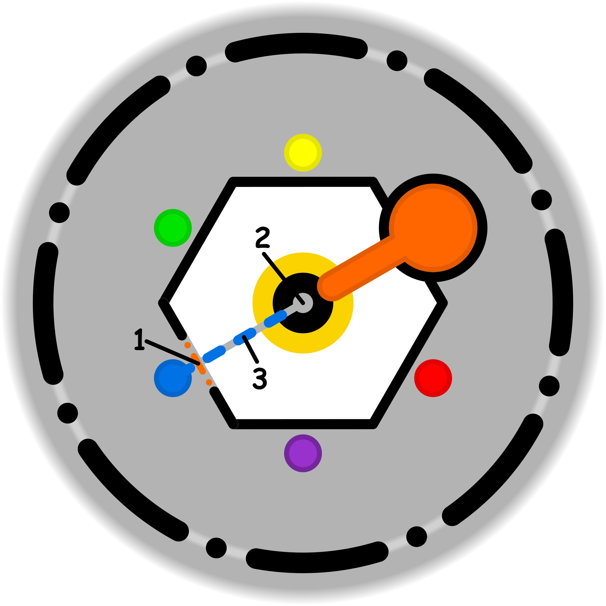

### CONCETTO CHIAVE: 
Sostituire la paralisi delle aspettative grandiose con la concretezza di piccoli obiettivi realizzabili, costruendo competenza e successo attraverso una valutazione obiettiva delle proprie capacità attuali.

### SPIEGAZIONE SIMBOLO:

#### 1. Trigger:
L'elemento scatenante risiede nella presenza di una soglia etica inconsapevole e strutturalmente debole, che si rivela estremamente permeabile a influenze esterne. Questa vulnerabilità nasce dal bisogno di trovare sollievo rispetto a uno stato di affaticamento mentale, spingendo il soggetto a cercare dei palliativi che permettano di alleggerire il peso psicologico accumulato. Invece di fungere da filtro protettivo e consapevole, questo confine etico si lascia attraversare da stimoli impropri, ponendo le basi per l'accettazione di soluzioni superficiali che non affrontano la radice del disagio ma cercano solo una gratificazione o un sollievo immediato.

#### 2. Situazione Disfunzionale: 
La dinamica problematica si concretizza quando l'incertezza proveniente dall'ambiente esterno riesce a penetrare all'interno del soggetto, imponendo una rigidità d'azione che toglie naturalezza al comportamento. A causa della permeabilità della soglia etica, l'individuo assimila inconsapevolmente dinamiche, modelli e direzioni predefinite che non gli appartengono realmente, portando dentro di sé influenze estranee. Si instaura così un flusso irregolare ma costante dall'esterno verso l'interno, dove le azioni perdono la loro spontaneità per seguire binari rigidi. Questa interiorizzazione forzata trasforma l'agire in una sequenza di risposte condizionate da fattori esterni che non dovrebbero avere accesso alla sfera privata.

#### 3. Conseguenze Emotive: 
Sul piano emotivo, il soggetto sperimenta una spiacevole sensazione di forzatura e di ostinazione verso attività percepite come gravose e poco autentiche. Si agisce spinti dalla convinzione che l'inazione possa peggiorare le cose, finendo per impegnarsi in sforzi sterili per risolvere problemi di cui non si intravede una reale via d'uscita. Per gestire questo disagio e dare un senso momentaneo all'agire, si ricorre a nuovi "anestetici" o palliativi che, paradossalmente, indeboliscono ulteriormente la soglia etica. Si attiva così un circolo vizioso autorigenerante che tende a cronicizzarsi: la tensione derivante dalla forzatura alimenta il bisogno di ulteriori distrazioni, stabilizzando una dinamica ciclica di insoddisfazione.