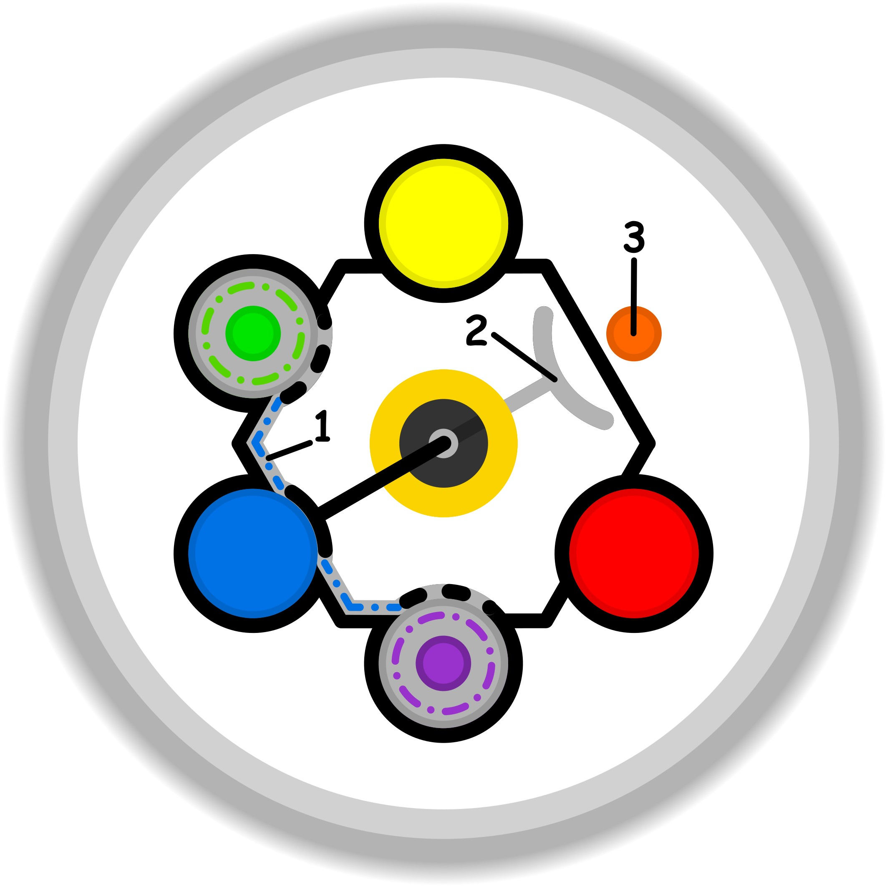

### CONCETTO CHIAVE: 
Superare la rigidità delle proprie abitudini per aprirsi alle sfere di interesse dell'altro espande i confini del proprio mondo e nutre la connessione sociale.

### SIMBOLISMO: 
La scena si svolge in un'antica biblioteca dei sentieri, dove le pareti non sono fatte di libri, ma di migliaia di porte in miniatura. Al centro, un "Curatore di Possibilità" (il sé) non indica più l'unica grande porta grigia e usurata alle sue spalle (la consuetudine ripetitiva), ma presenta a un "Viaggiatore Ospite" (l'altro) un vassoio d'argento colmo di chiavi incantate e piccoli mondi in bottiglia. Ogni chiave ha una forma bizzarra — una fatta di corallo, una di piume, una di ingranaggi d'orologio — e rappresenta una proposta che tiene conto degli interessi dell'ospite. Dietro l'Ospite, la sua lanterna personale proietta una luce che, toccando le chiavi, rivela paesaggi inesplorati che iniziano a germogliare dal pavimento di marmo, simboleggiando il "pensiero laterale" e l'allargamento degli orizzonti che nasce dal rinunciare alle proprie ossessioni per accogliere l'altro.
### PROMPT POSITIVO: 
anime-style illustration, high quality character artwork, detailed eyes, clean line art, cel shading, vibrant colors, professional character illustration, not photorealistic, 2D artwork, illustration, digital artwork, 2D art, stylized, drawn by an artist, not a photograph, not photorealistic, anime rendering, masterpiece, best quality, highly detailed, symbolic surrealism, conceptual art. A grand, ethereal library where the walls are filled with thousands of tiny, glowing ornamental doors. In the center, an "Architect of Horizons" stands behind a table made of woven starlight and silver roots. On the table, he offers a wide, ornate tray filled with "Interesting Choices": a miniature forest in a glass sphere, a key made of iridescent bird feathers, and a compass that points to a shifting aurora. An ethereal guest reaches out, their presence causing new, vibrant landscapes of flowers and geometric light to bloom from the floor tiles. In the background, a single, dull, grey stone path is cracked and abandoned, representing old habits. Cinematic lighting, warm glow of discovery, intricate textures of crystal and moss, atmosphere of curiosity and mutual respect, storytelling environment, professional composition.
### PROMPT NEGATIVO: 
worst quality, low quality, blurry, distorted, literal representation, office meeting, business presentation, person pointing at a whiteboard, single choice, dark and oppressive, monotony, static, boring, monochromatic, aggression, simple room, lack of detail, watermark, text, signature, low resolution, flat colors, cartoonish, generic fantasy, cluttered.
### SPIEGAZIONE SIMBOLO:

#### 1. Trigger:
L'innesco avviene a livello inconsapevole quando la mente si ritrova bloccata da un dubbio che, in condizioni normali, verrebbe risolto naturalmente attraverso l'attività ludica e la sperimentazione pratica. Invece di agire direttamente sulla realtà per chiarire o dissolvere l'incertezza, il soggetto sperimenta un senso di abbandono della propria parte complementare, sentendosi spinto a cercare rifugio in soluzioni già pronte o in significati puramente ideali e astratti. Si evita il contatto diretto con l'esperienza, sperando nella fortuna o nella creazione di modelli teorici completi che prescindono dalla pratica, trasformando la ricerca di una soluzione in una fuga verso palliativi che offrano un sollievo immediato ma illusorio.
#### 2. Situazione Disfunzionale: 
La dinamica disfunzionale si palesa quando l'individuo non riesce più ad accedere alla libertà e alla genuinità del gioco senza essere costantemente distratto dalla necessità di ricorrere a dei palliativi. Emerge una profonda sfiducia nella propria sfera creativa, che non viene più percepita come una risorsa affidabile o dotata di una propria dignità e di un motivo d'essere sufficiente. Questa mancanza di tranquillità interiore impedisce di sfruttare appieno le potenzialità della sperimentazione libera, poiché il contesto in cui ci si muove è dominato dall'incertezza e dalla diffidenza. Il soggetto si ritrova così in un'area operativa in cui il "fare" perde il suo valore intrinseco, lasciando spazio a un'insicurezza che mina la possibilità di un approccio esplorativo autentico.
#### 3. Conseguenze Emotive: 
Sul piano emotivo, il progressivo distacco dalla dimensione del gioco sfocia in uno stato di apatia e di inaccessibilità delle proprie risorse creative. Poiché non viene riconosciuto un valore adeguato alla parte ludica, essa si ritrae, obbligando la mente a una ricerca compulsiva di compensazioni facili e superficiali che non portano a una reale maturazione. Questo genera un circolo vizioso autorigenerante in cui ci si accontenta di risultati incompleti, rinunciando alla gratificazione profonda che deriverebbe dal lavoro di familiarizzazione con l'esperienza. La percezione di inaffidabilità della propria sfera creativa si stabilizza, trasformando l'interesse in indifferenza e rendendo l'esperienza vitale frammentata e priva di una reale complicità tra pensiero e azione.