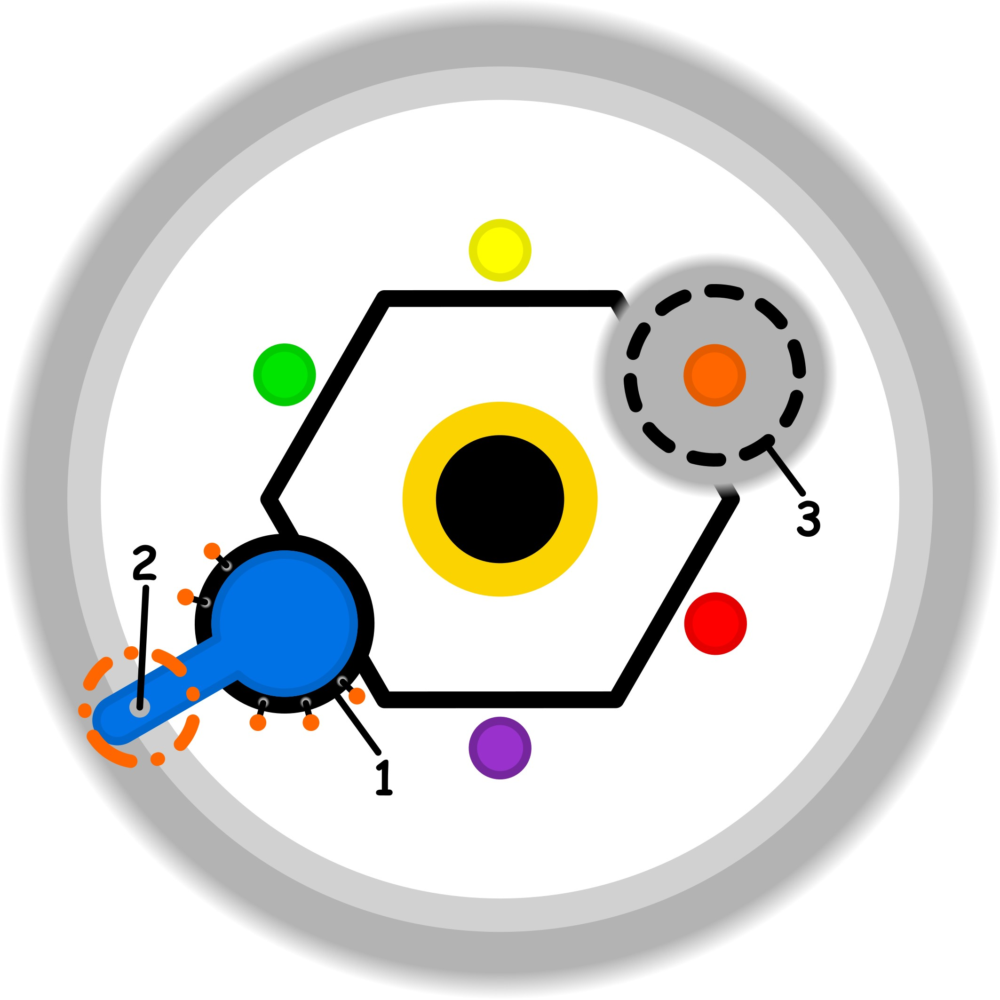

### CONCETTO CHIAVE: 
L'abitudine di generare molteplici varianti e percorsi creativi nel proprio giardino interiore per trasformare l'obbligo rigido in una scelta personale, fluida e gratificante.

### SPIEGAZIONE SIMBOLO:

#### 1. Trigger:
L'innesco del processo si identifica in una persistente sensazione di fastidio che emerge quando la mente si ritrova costretta ad accettare compromessi ricorrenti. Invece di favorire e semplificare i processi cognitivi naturali, si manifesta un ostacolo frequente che altera la fluidità del pensiero e della comprensione. Questo segnale di disagio non è un evento isolato, ma una presenza regolare che indica come l'attività mentale stia subendo una deviazione rispetto alla sua funzione ottimale, segnalando che l'individuo sta operando in una condizione di adattamento forzato e non del tutto funzionale.

#### 2. Situazione Disfunzionale: 
La condizione problematica si caratterizza per l'utilizzo di palliativi inconsapevoli che agiscono come uno schermo, nascondendo la realtà della situazione e del compromesso in atto. Il soggetto si ritrova a tentare di realizzare compiti che superano le proprie competenze attuali o che, in alcuni casi, risultano essere del tutto irrealizzabili, senza tuttavia averne piena coscienza. Questa mancanza di consapevolezza rende la situazione particolarmente critica, poiché l'individuo non percepisce lo scollamento tra le proprie capacità reali e gli obiettivi prefissati, continuando a investire energie in una direzione priva di sbocchi concreti.

#### 3. Conseguenze Emotive: 
Le ripercussioni sul piano emotivo generano un'area di profonda incertezza che spinge il soggetto verso forme di distrazione mentale e intrattenimento superficiale fornito dall'esterno. Si avverte una chiara forzatura dovuta all'eccesso di sforzo, che sfocia in un senso di colpa logorante. Questo vissuto emotivo frammenta le risorse interiori, dividendole tra i tentativi corretti di risoluzione e l'uso di palliativi che sottraggono tempo ed energia preziosi. Il risultato finale è un circolo vizioso autorigenerante in cui la causa del disagio si alimenta costantemente, impedendo di trovare la direzione corretta.