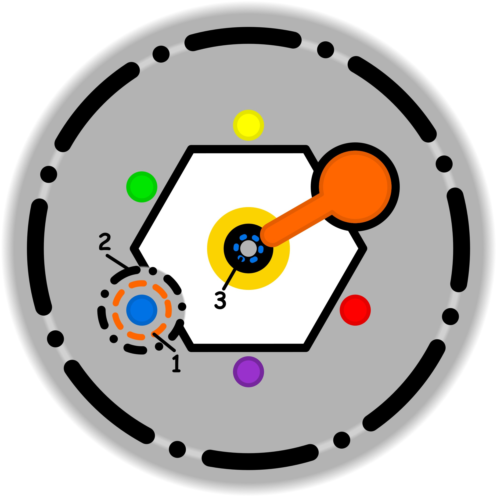

### CONCETTO CHIAVE: 
Sospendere l'uso dei "lenitivi" quotidiani e delle gratificazioni di compensazione per smascherare e recidere i vincoli invisibili che limitano la nostra libertà di scelta.

### SIMBOLISMO: 
La scena ritrae un'artigiana seduta al suo tavolo da lavoro, circondata da una fitta nebbia iridescente e profumata (la compensazione) che sembra confortevole ma che le impedisce di vedere chiaramente i propri strumenti. Con un gesto deciso, la donna scosta un lembo di questa nebbia come se fosse un tessuto leggero, rivelando al di sotto delle spine di ossidiana nera e delle catene sottili come fili di ragno che le stringono i polsi e si intrecciano agli ingranaggi del suo lavoro (i vincoli occulti). Dove la nebbia viene rimossa, la luce diventa cruda e rivelatrice, permettendole di impugnare un paio di cesoie d'argento (la volontà attiva) per tagliare i legami finalmente visibili. 
### PROMPT POSITIVO: 
anime-style illustration, high quality character artwork, detailed eyes, clean line art, cel shading, vibrant colors, professional character illustration, not photorealistic, 2D artwork, illustration, digital artwork, 2D art, stylized, drawn by an artist, not a photograph, not photorealistic, anime rendering, masterpiece, best quality, surrealist ethereal art style, a skilled female artisan at a wooden workbench, she is pulling away a floating translucent iridescent silken veil that represents "compensation", beneath the veil sharp black obsidian thorns and thin spectral chains are revealed binding her wrists and the clockwork tools on the table, high contrast lighting, the area covered by the veil is soft and hazy with pastel colors, the revealed area is sharp and clear with cold dramatic light, she holds silver pruning shears ready to cut the thorns, intricate details of gears and silk textures, cinematic composition, volumetric fog, deep teal and violet shadows, golden highlights on the silver tools, 8k resolution, storytelling atmosphere.
### PROMPT NEGATIVO: 
worst quality, low quality, jpeg artifacts, signature, watermark, blurry, literal medicine, pills, hospital setting, messy, chaotic, dark without contrast, simple background, ordinary room, realistic photography, peaceful without tension, laziness, stagnation, broken tools, ugly, deformed hands.
### SPIEGAZIONE SIMBOLO:

#### 1. Trigger:
L'innesco primario, definito come "uno", si identifica in una forzatura deliberata e consapevole volta alla distrazione sistematica, utilizzata come strumento per non pensare e negare problemi che non si desidera affrontare. Questo meccanismo nasce da un'azione volontaria di evitamento, dove il soggetto sceglie di immergersi in attività eccedenti che fungono da barriera contro la riflessione autentica. Tali eccessi quotidiani agiscono come stimoli destabilizzanti che interrompono il confronto reale con le proprie necessità irrisolte, innescando un processo in cui la negazione del problema diventa il punto di partenza di un ciclo depotenziante.
#### 2. Situazione Disfunzionale: 
La fase disfunzionale, o "due", si caratterizza per una soglia etica che risulta inconsapevolmente incompleta o frammentata, rendendo l'individuo incapace di perseguire i propri interessi autentici o le proprie intuizioni. In questo stato, l'agire scivola verso forme di intrattenimento sterile che consumano risorse preziose, come tempo ed energia, senza produrre alcun avanzamento concreto o utilità reale. Si stabilizza così una dinamica circolare e priva di sbocchi, paragonabile a un gatto che si morde la coda, in cui l'assenza di un lavoro utile e il continuo spreco di risorse intrappolano il soggetto in un problema che sembra non avere né inizio né fine.
#### 3. Conseguenze Emotive: 
Le ripercussioni emotive, identificate come "tre", si manifestano attraverso l'interiorizzazione di un'ostinazione profonda: mentre nella pratica l'individuo rimane bloccato dalla distrazione, internamente sviluppa un desiderio idealizzato di riuscire a compiere l'azione. Questa sorta di "carota" psicologica fornisce una motivazione apparente ma illusoria, poiché si fonda su aspettative non realizzabili che non offrono alcuna protezione contro gli eccessi del trigger iniziale. Il vissuto è segnato da una tensione costante tra l'incapacità pratica di agire e una proiezione mentale di successo che rimane irraggiungibile, alimentando una sofferenza ciclica che persiste finché uno degli elementi del sistema non viene riconosciuto e abbandonato.