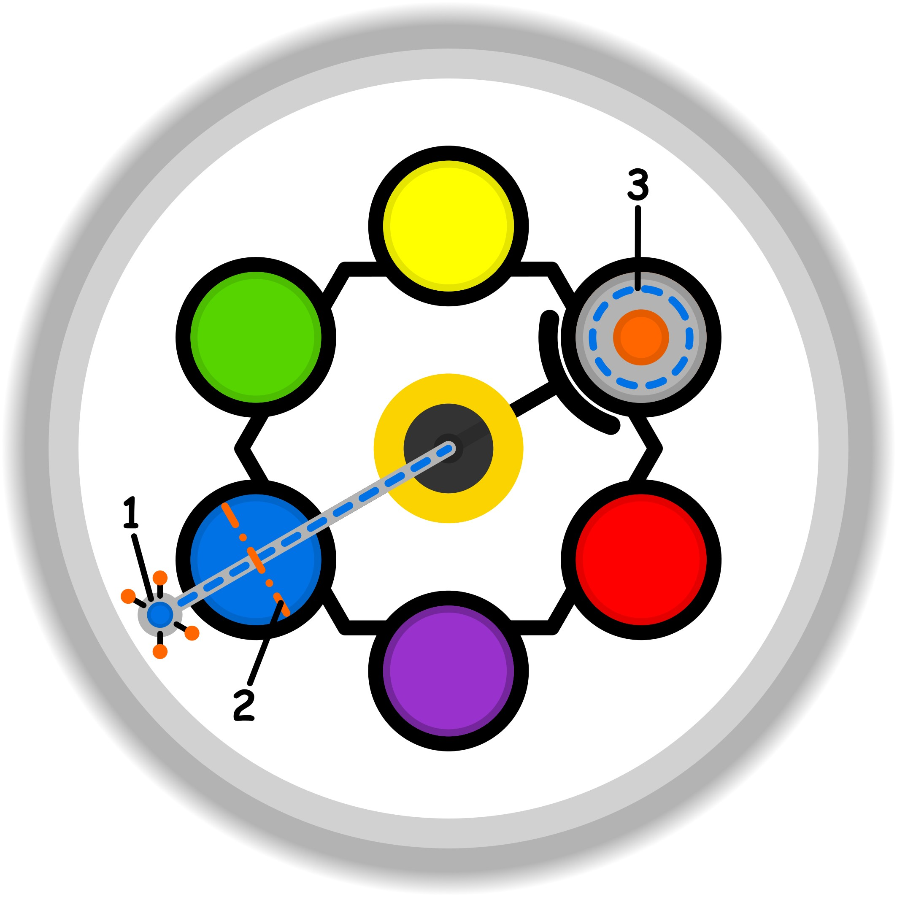

### CONCETTO CHIAVE: 
La motivazione si alimenta trasformando la rigidità del dovere e della sopportazione in un’esplorazione creativa e personale che coinvolge i sensi e le preferenze individuali.

### SIMBOLISMO: 
La scena rappresenta il passaggio da un mondo "automatico" e grigio (le regole implicite e la scuola) a un territorio vibrante di scoperte. Un esploratore non segue un sentiero già tracciato, ma lo genera camminando: dove poggia i piedi o tocca le pareti, la pietra fredda si trasforma in mappe mentali luminose, filamenti di colore e forme fluide che rispecchiano le sue preferenze personali. Il "freno a mano" della sopportazione è raffigurato da pesanti catene d'ombra che si dissolvono al tocco di una luce calda e speculativa.
### PROMPT POSITIVO: 
anime-style illustration, high quality character artwork, detailed eyes, clean line art, cel shading, vibrant colors, professional character illustration, not photorealistic, 2D artwork, illustration, digital artwork, 2D art, stylized, drawn by an artist, not a photograph, not photorealistic, anime rendering, (masterpiece, best quality, ultra-detailed), a visionary alchemist-explorer in a transitional space, one side of the scene is a gloomy monochromatic hallway of heavy stone and rigid iron gears representing "sopportazione" and social rules, the other side is an explosion of vibrant bioluminescent colors and fluid shapes, the explorer is touching a cold wall and from his fingertips spread glowing neon mind maps and intricate diagrams in shades of azure and gold, floating ink droplets and prismatic light shards fill the air, personification of creative motivation, ethereal atmosphere, cinematic lighting, soft warm glow illuminating the explorer's face, rich textures, storytelling composition, (vibrant colors, sparks, swirling energy), intricate details of glowing symbols and personal preferences turning into reality.
### PROMPT NEGATIVO:
(low quality, worst quality, blurry), monochrome, dull colors, literal classroom, office cubicle, boring, static, depressed person, chains not breaking, literal school desk, simple background, ugly, deformed, text, watermark, signature, flat lighting, messy, distorted anatomy, realistic photo.
### SPIEGAZIONE SIMBOLO:

#### 1. Trigger:
L'innesco del processo si identifica in una sensazione di fastidio che emerge quando la mente si scontra con compromessi ricorrenti situati sulla soglia etica, proprio nel punto di contatto con l'ambiente esterno. Questo ostacolo impedisce la realizzazione di obiettivi e traguardi prefissati, creando una frizione costante tra l'intenzione e l'azione pratica. Inoltre, la dinamica si autoalimenta poiché i nuovi compromessi generati dai tentativi di controllo diventano a loro volta stimoli che riattivano il circolo vizioso, rendendo palese l'assenza di progresso e il mancato raggiungimento di un miglioramento reale.
#### 2. Situazione Disfunzionale: 
La condizione problematica è caratterizzata da un ricorso inconsapevole a palliativi superficiali, che portano l'individuo ad accontentarsi di attività di mero intrattenimento invece di ricercare gli elementi autentici e profondi del gioco. In questa fase, la dimensione ludica perde la sua funzione rigenerativa e didattica; il tempo viene semplicemente occupato senza che vi sia un reale guadagno in termini di qualità o di nuove competenze. Si verifica uno scollamento dalla libertà di sperimentare senza timore del fallimento, accettando soluzioni di ripiego che non permettono alcun avanzamento effettivo o il recupero di capacità precedentemente acquisite.
#### 3. Conseguenze Emotive: 
Sul piano emotivo, si manifesta una forzatura psicologica e un'ostinazione nel voler controllare eccessivamente la sfera del gioco, proprio a causa della consapevolezza latente di star utilizzando semplici distrazioni e palliativi. Questo tentativo di controllo rigido non risolve il problema, ma introduce ulteriori compromessi che appesantiscono il vissuto individuale. Si instaura una dinamica circolare complessa, tipica dei bias cognitivi, in cui la percezione di stagnazione e l'incapacità di progredire diventano difficili da scardinare. La normalizzazione di questi stati emotivi negativi rende quasi invisibile il disagio, intrappolando il soggetto in un loop di insoddisfazione e controllo infruttuoso.