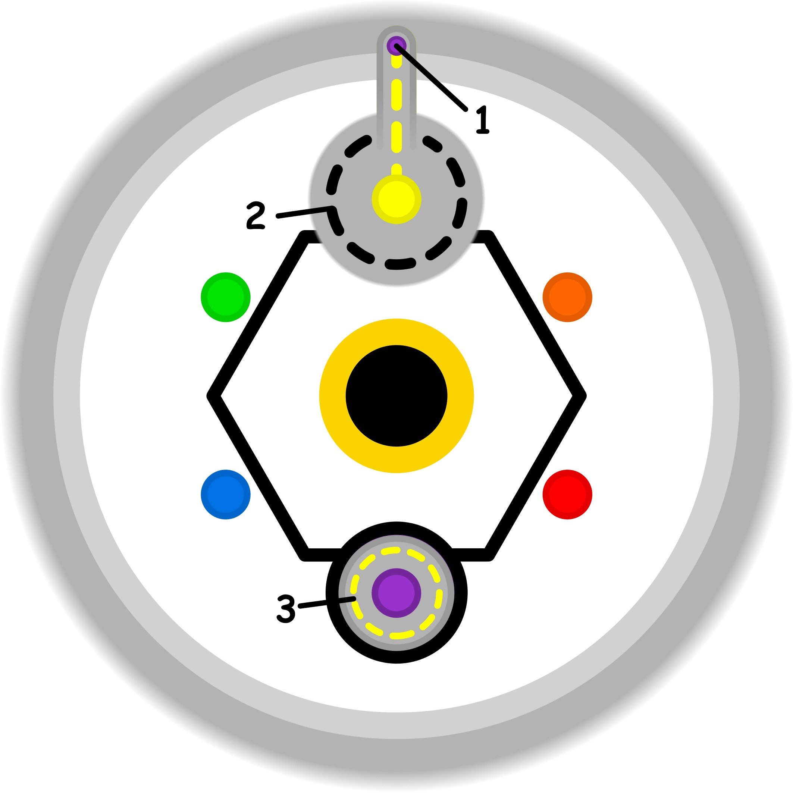

### CONCETTO CHIAVE: 
La "giusta responsabilità" è l'equilibrio consapevole tra l'impegno verso uno scopo e il rispetto dei propri ritmi, sostituendo l'ideale del sacrificio estremo con una gestione personalizzata e sostenibile che tutela il diritto al recupero.

### SPIEGAZIONE SIMBOLO:

#### 1. Trigger:
Il fattore scatenante risiede nel tentativo di superare i propri limiti personali in ambiti dove la padronanza e la competenza sono ancora carenti. Questa dinamica è alimentata dalla volontà di soddisfare le alte aspettative che nutriamo verso noi stessi e dal desiderio di proiettare all'esterno un'immagine di successo e abilità. Ci si ritrova così a forzare la propria natura, spingendosi in situazioni che vanno oltre le reali possibilità del momento solo per dimostrare di essere all'altezza della situazione. È un impulso che nasce dalla necessità di apparire preparati anche quando mancano le basi concrete per esserlo.

#### 2. Situazione Disfunzionale: 
La situazione problematica si sviluppa quando si abbandona il percorso naturale di apprendimento graduale e miglioramento costante attraverso la pratica. Prevale invece un forte conformismo sociale, che spinge l'individuo a sentirsi in obbligo di soddisfare gli standard e le aspettative altrui a ogni costo. Questo crea una forzatura costante, dove si scavalca la preparazione necessaria per ostentare una competenza fittizia. Si agisce in uno stato di incertezza e pressione, violando la propria soglia etica pur di mettere in mostra successi che non hanno una base solida nella realtà delle proprie capacità.

#### 3. Conseguenze Emotive: 
Sul piano emotivo, il risultato è una significativa riduzione dell'autostima e del senso di appartenenza a se stessi. Poiché l'azione è finalizzata a convincere gli altri piuttosto che a maturare una crescita autentica, non si riesce a sviluppare un sentimento di sincerità e genuinità interiore. Anche se si ottiene il riconoscimento esterno, rimane l'incapacità di convincere se stessi del proprio valore, alimentando un bisogno latente di fare sempre di più. Si innesca così una dinamica circolare e ripetitiva che si autorigenera, intrappolando la persona in una ricerca continua e insoddisfacente di conferme.