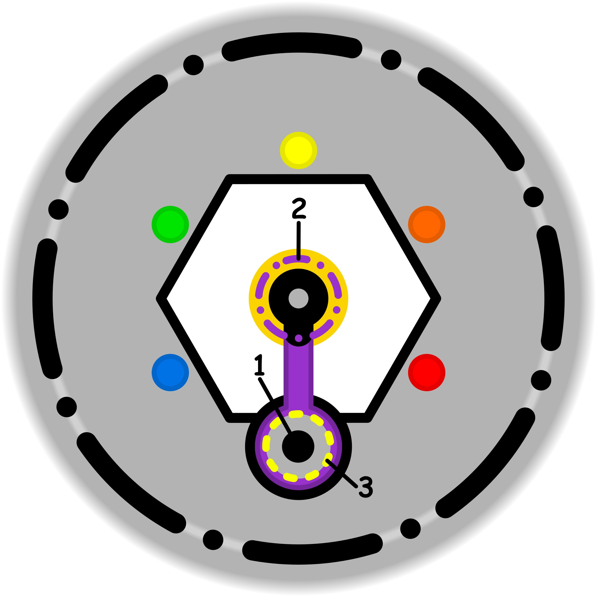

### CONCETTO CHIAVE: 
Esprimere pareri sinceri significa offrire agli altri (e a se stessi) informazioni trasparenti come un dono non vincolante, preservando la totale libertà di scelta e il prezioso diritto di imparare dai propri errori senza il peso del giudizio.

### SIMBOLISMO: 
La scena si svolge su un sentiero di vetro sospeso sopra un abisso di nebbia. Un Viaggiatore (l'altro o il sé) avanza con cautela. Accanto a lui, una figura eterea (colui che esprime il parere) non usa corde o barriere per fermarlo, ma tiene tra le mani una lanterna a forma di soffione, i cui semi sono piccole lucciole dorate. La figura soffia dolcemente su questi semi: le lucciole volano avanti e si posano su una crepa invisibile nel vetro del sentiero, illuminandola. Le lucciole non bloccano il passaggio, ma rendono il pericolo "trasparente". Il Viaggiatore osserva la luce: ha la mano tesa verso la crepa, libero di calpestarla per testarne la resistenza o di aggirarla. Non c'è tensione tra le due figure, solo un silenzio rispettoso, poiché l'informazione è stata scambiata come uno strumento e non come un comando.
### PROMPT POSITIVO: 
anime-style illustration, high quality character artwork, detailed eyes, clean line art, cel shading, vibrant colors, professional character illustration, not photorealistic, 2D artwork, illustration, digital artwork, 2D art, stylized, drawn by an artist, not a photograph, not photorealistic, anime rendering, masterpiece, best quality, highly detailed, symbolic surrealism, conceptual art. A high-altitude path made of thick, translucent glass tiles floating above a sea of soft white clouds. A "Counselor" figure with a serene expression holds a glowing dandelion-shaped lantern. They gently blow glowing, golden firefly seeds toward a traveler ahead. These fireflies illuminate a hidden fracture in the glass path, making the potential danger visible but not obstructing the way. The traveler stands at the edge of the fracture, looking down with curiosity and calm reflection, free to choose their next step. The Counselor’s hands are open and relaxed, symbolizing the absence of expectations or "blackmail." Ethereal lighting, warm golden highlights against a soft blue dawn, intricate glass textures, atmosphere of profound respect and transparency, storytelling environment, professional composition.
### PROMPT NEGATIVO: 
worst quality, low quality, blurry, distorted, literal representation, office meeting, argument, shouting, pulling, chains, ropes, barriers, walls, dark and oppressive, heavy shadows, judgemental expressions, person falling, chaos, monochromatic, messy, lack of detail, watermark, text, signature, low resolution, flat colors, cartoonish, generic fantasy.
### SPIEGAZIONE SIMBOLO:

#### 1. Trigger:
L'innesco di questa dinamica si manifesta nel momento in cui una componente della propria identità tenta deliberatamente di stabilire un legame, un contatto o una forma di complicità con l'esterno attraverso modalità che non risultano spontanee. Si tratta di un'azione guidata da un modello di realtà costruito artificialmente, che si allontana dalla naturalezza individuale per cercare di proiettare un'immagine specifica o per forzare una connessione interpersonale che non nasce da un impulso autentico. Questo tentativo di creare una sintonia non genuina rappresenta il punto di partenza del processo disfunzionale.
#### 2. Situazione Disfunzionale: 
La fase problematica emerge quando l'individuo si trova a dover rielaborare forzatamente il proprio interesse verso un determinato oggetto o situazione, spesso a causa di un'inconsapevole indifferenza di fondo che si cerca di mascherare. Nonostante manchi un reale coinvolgimento, si mette in atto uno sforzo mentale per autoconvincersi che quel tema sia rilevante. Viene così attribuito un valore artificiale e sproporzionato a qualcosa che non lo possiede spontaneamente, creando una profonda discrepanza tra ciò che si prova realmente e l'importanza che si cerca di manifestare esternamente.
#### 3. Conseguenze Emotive: 
A livello interiore, questa forzatura genera un percepibile senso di attrito, derivante dalla consapevolezza implicita di star ostentando un risultato o un merito che è privo di sostanza e contenuto reale. Poiché l'azione non produce benefici autentici, l'individuo avverte il peso di una mancanza di sincerità che non porta a nulla di positivo. Questo vuoto alimenta la necessità compulsiva di continuare a distribuire importanza in modo fittizio, dando vita a un meccanismo circolare e ripetitivo che intrappola la persona in un circolo vizioso privo di sbocchi.