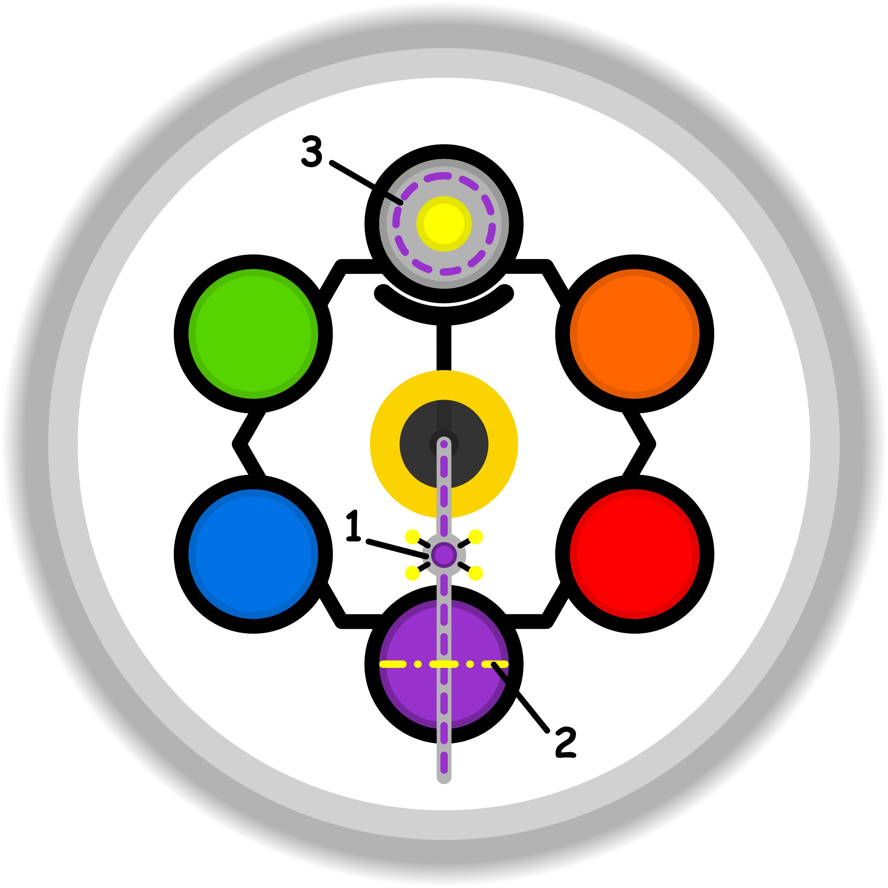

### CONCETTO CHIAVE: 
L'abbattimento dei muri dell'inadeguatezza attraverso il recupero dello sguardo curioso del bambino, trasformando l'esperienza altrui da esempio irraggiungibile a sorgente di passione condivisa.

### SPIEGAZIONE SIMBOLO:

#### 1. Trigger:
Il trigger si identifica nel senso di fastidio e irritazione che scaturisce dal ricevere critiche riguardanti le proprie prestazioni e abilità personali. Questo stimolo si colloca in un punto di transizione critico, ovvero la soglia etica dove l'autocritica interiore si fonde con il giudizio proveniente dall'esterno. Non si tratta solo di ascoltare un parere, ma di interiorizzare commenti giudicanti che vengono percepiti come ferite profonde, poiché vanno a toccare la percezione del proprio valore e della propria competenza, innescando una reazione emotiva immediata.

#### 2. Situazione Disfunzionale: 
La dinamica problematica consiste in una dissimulazione inconsapevole del proprio interesse, in cui l'individuo finge di essere indifferente alle osservazioni critiche ricevute. Si mette in atto una sorta di recita in cui si ignora il giudizio esterno, nonostante internamente lo si consideri veritiero o meritato. Manca la capacità di filtrare le critiche in modo oggettivo per distinguere quelle costruttive da quelle dettate dall'incapacità altrui di fornire osservazioni legittime; di conseguenza, i commenti negativi penetrano senza barriere nella sfera dello spirito, alimentando una convinzione di inadeguatezza che non viene validata razionalmente.

#### 3. Conseguenze Emotive: 
Le ripercussioni sul piano emotivo portano a una drastica riduzione dello slancio vitale e della capacità d'azione dell'individuo. L'incertezza che ne deriva spinge la persona a conformarsi passivamente ai giudizi ricevuti, nel tentativo di sentirsi ancora parte del gruppo di appartenenza attraverso una forzatura psicologica. Questo processo comprime le reali abilità del soggetto, depotenziandolo costantemente e alimentando la sensazione di non meritare fiducia. Si genera così un circolo vizioso in cui ogni minima osservazione viene vissuta come un attacco paralizzante, consolidando una dinamica ciclica che impedisce la crescita autentica.