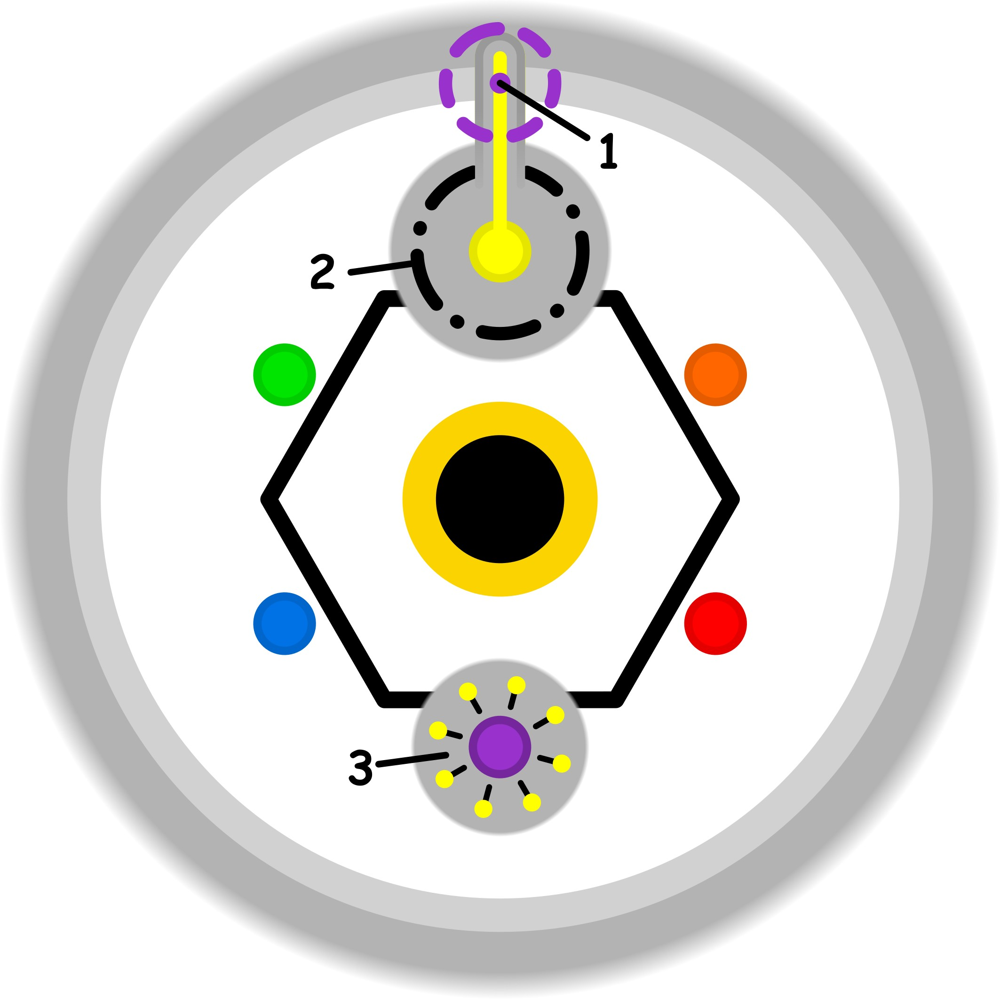

### CONCETTO CHIAVE: 
Trasformare la voce interiore da sabotatore critico a consigliere saggio attraverso un dialogo paziente e orientato alle domande, educando la propria parte interiore a cercare soluzioni comuni anziché rievocare fallimenti passati.

### SPIEGAZIONE SIMBOLO:

#### 1. Trigger:
Il trigger si manifesta nel momento in cui l'individuo si accinge a oltrepassare i propri limiti personali e professionali, nonostante manchi ancora della competenza necessaria per farlo in modo efficace. Questa spinta non nasce da un'esigenza interiore di crescita, ma piuttosto da una sorta di obbligo percepito verso l'esterno, legato alla necessità di sentirsi integrati e appartenenti a un determinato gruppo sociale o lavorativo. Tale dinamica comporta una fatica strutturale e una sofferenza psicologica, poiché si cerca di forzare una prestazione per la quale non si è ancora realmente pronti, dando inizio a un processo di tensione costante.

#### 2. Situazione Disfunzionale: 
La situazione disfunzionale è caratterizzata da un profondo stato di incertezza, alimentato da un conformismo che impedisce di distinguere chiaramente quali siano le reali richieste dell'ambiente circostante. In questo contesto, il soggetto mette in atto una dissimulazione inconsapevole, cercando di mascherare la propria incapacità di comprendere come agire o in quale direzione muoversi per migliorare la propria condizione. Si evita deliberatamente di guardare in faccia la realtà della propria preparazione, preferendo fare finta di essere all'altezza della situazione piuttosto che affrontare il vuoto di competenze che impedisce una reale evoluzione.

#### 3. Conseguenze Emotive: 
Le conseguenze emotive si traducono in un senso di fastidio e irritazione ogni volta che vengono colti riferimenti o accenni alla propria mancanza di padronanza in un determinato settore. Anche se non si tratta di critiche dirette, queste vengono percepite come tali perché svelano l'inadeguatezza che si cercava di nascondere sia agli altri che a se stessi. Ne deriva una significativa riduzione delle proprie aspettative e la percezione dolorosa di non essere performanti come si vorrebbe apparire. Questo malessere alimenta paradossalmente il bisogno di dimostrare nuovamente il proprio valore, innescando una dinamica ciclica e ripetitiva che si autogenera continuamente.