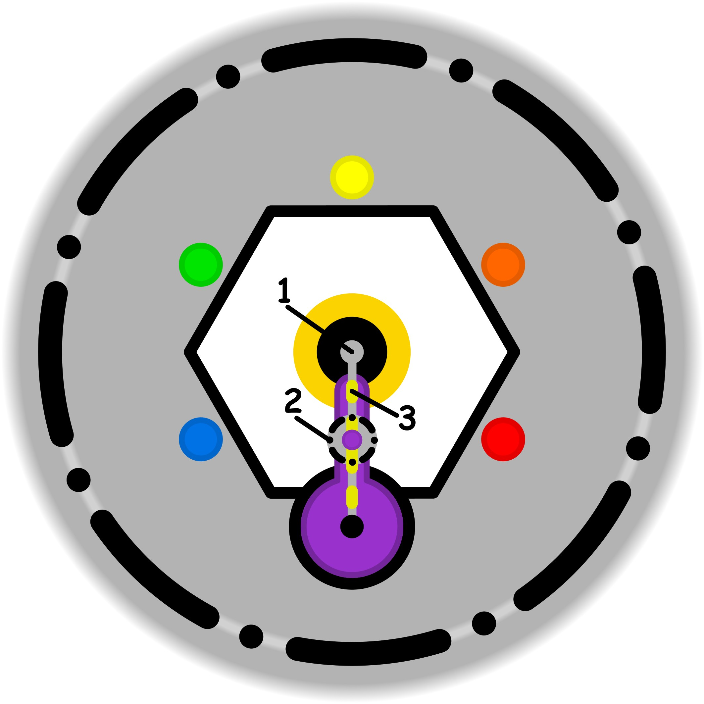

### CONCETTO CHIAVE: 
La transizione dal controllo ossessivo degli eventi esterni come rigido "custode della soglia" alla condivisione consapevole e trasparente delle proprie fragilità interiori per creare armonia relazionale.

### SPIEGAZIONE SIMBOLO:

#### 1. Trigger:
Il trigger è rappresentato da una condizione di profonda insicurezza e incertezza che colpisce la parte più intima dell'identità individuale. In questa fase, il soggetto si trova in uno stato di confusione riguardo alla necessità di conformarsi o adattarsi ai modelli che provengono dall'esterno. Nasce un dubbio fondamentale sulla coerenza di tali influenze esterne con la propria sfera interiore, generando una sorta di attrito o frizione psicologica. Si fatica a comprendere se ciò che viene proposto dal mondo esterno sia realmente in linea con i propri valori e la propria essenza, portando a una tensione tra l'adeguamento sociale e l'integrità personale.

#### 2. Situazione Disfunzionale: 
La situazione disfunzionale si colloca sulla soglia etica, quel delicato punto di transizione tra la dimensione interiore e la sfera dello spirito. Qui emerge un disinteresse inconsapevole nei confronti dell'efficienza e del miglioramento continuo: l'individuo smette di cercare attivamente modi per rendere le proprie azioni più efficaci perché non ritiene che sia necessario farlo. Si instaura una convinzione che impedisce di compiere sforzi per progredire o affinare le proprie attività. Questo atteggiamento passivo blocca una crescita autentica, poiché si rinuncia alla ricerca della qualità e dell'eccellenza, rimanendo fermi in una stasi che ignora il potenziale di perfezionamento.

#### 3. Conseguenze Emotive: 
Le conseguenze emotive si manifestano come una forzatura psicologica che spinge il soggetto ad accettare passivamente stimoli o idee esterne, anche quando non suscitano alcun interesse reale. Sotto l'influenza del conformismo, ci si autoconvince che debba esserci necessariamente qualcosa di utile o positivo in ciò che viene detto o proposto dall'esterno, nonostante l'incapacità di individuarne l'utilità concreta. Si vive così un senso di sterilità, essendo privi di esperienze utili che permettano di valutare se ciò che si riceve sia positivo o semplicemente fine a se stesso. Questo stato produce una percezione di inutilità derivante dal subire influenze che non portano ad alcun arricchimento tangibile.