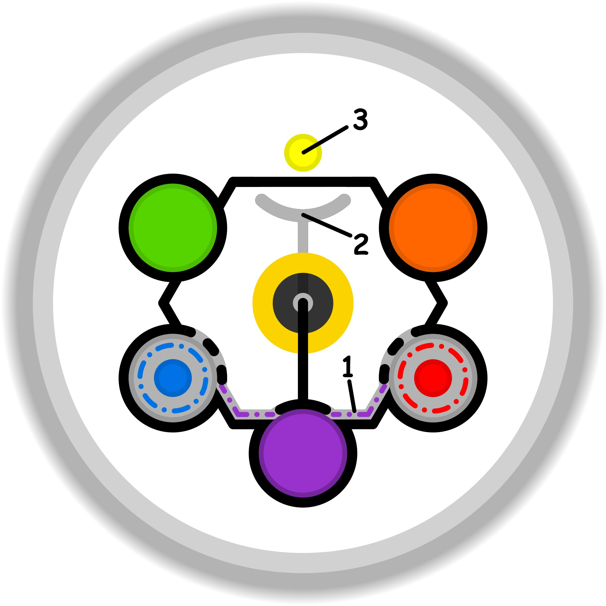

### CONCETTO CHIAVE: 
Trasformare l'invidia e il senso di inadeguatezza derivanti dal confronto con gli altri in una bussola per l'auto-scoperta, coltivando un dialogo interiore gentile che permette di progredire con i propri tempi e metodi.

### SPIEGAZIONE SIMBOLO:

#### 1. Trigger:
Il punto di partenza risiede in un profondo e spesso inconsapevole disinteresse che nasce all'interno della sfera dello spirito verso il processo di apprendimento o di perfezionamento di sé. Invece di affrontare l'impegno necessario per acquisire nuove competenze o migliorare quelle esistenti, la mente attiva dei meccanismi di difesa cercando scappatoie o alternative per evitare di confrontarsi con ciò che ancora non si sa fare. Si assiste alla creazione intenzionale di nuove priorità, spesso fittizie, che servono a distogliere l'attenzione e le energie da compiti percepiti come estranei o non appartenenti alla propria identità autentica, portando a una fuga dalle sfide evolutive reali.

#### 2. Situazione Disfunzionale: 
La dinamica problematica emerge quando si spezza l'equilibrio e il rapporto di complicità naturale tra l'ispirazione interiore e le abilità pratiche del soggetto. Questa rottura genera uno stato di incertezza operativa, in cui l'individuo tenta di adeguarsi a modelli esterni o a standard di comportamento senza che vi sia un reale senso di appartenenza o una connessione profonda con ciò che sta facendo. Si crea un corto circuito tra le aspettative personali e la realtà delle proprie competenze del momento, rendendo impossibile separare ciò che si vorrebbe essere da ciò che effettivamente si è in grado di realizzare, portando a un agire forzato e privo di autenticità.

#### 3. Conseguenze Emotive: 
Sul piano dei sentimenti e dei comportamenti riflessi, si manifesta una rassegnazione che porta al progressivo abbandono del desiderio di curare la propria sfera delle abilità, la quale smette di essere un supporto affidabile. La mancanza di una base solida impedisce l'esercizio della costanza, rendendo l'individuo schiavo delle vecchie abitudini e di convinzioni rigide su ciò che crede di saper fare. Questo blocco emotivo genera una dipendenza da modelli predefiniti e una ricerca compulsiva di diversivi o nuove urgenze per giustificare l'incapacità di progredire, vivendo in una condizione di perenne affanno in cui mancano il tempo, la capacità o la reale volontà di imparare.