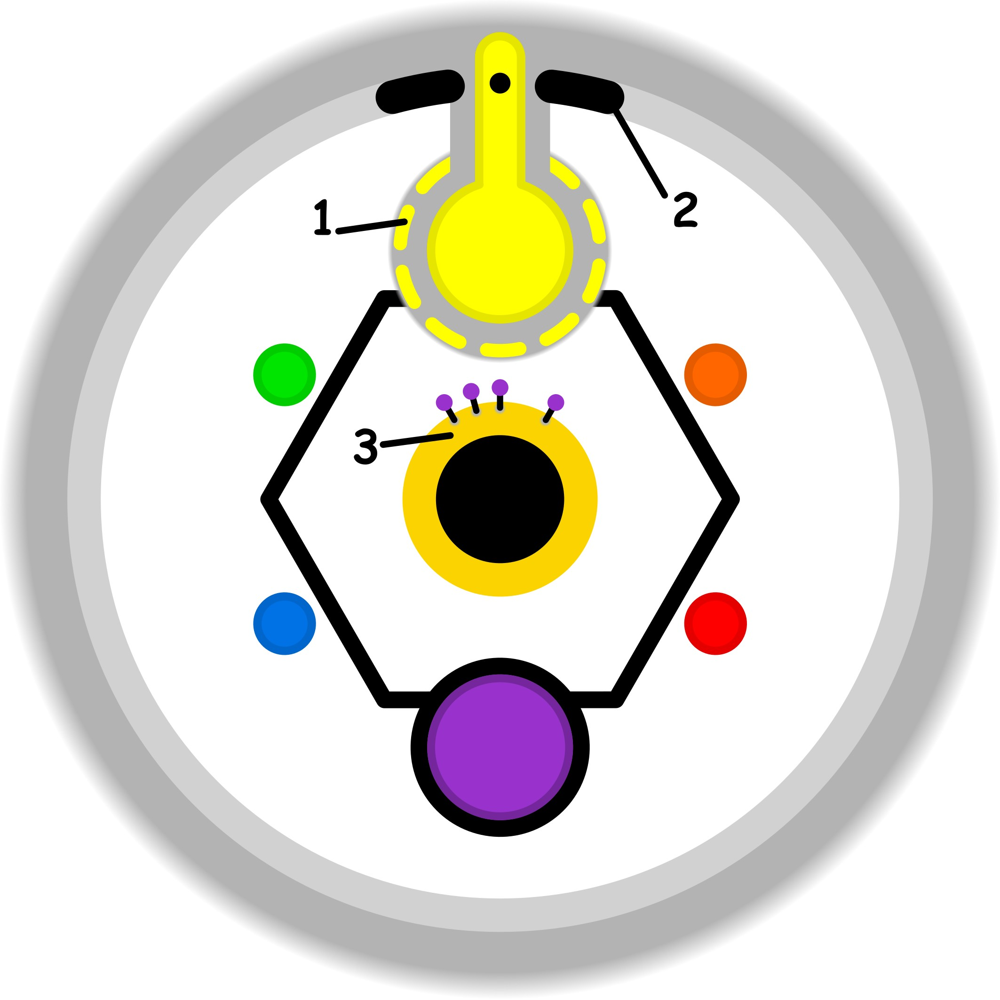

### CONCETTO CHIAVE: 
Utilizzare l'allerta istintiva del pregiudizio come un segnale diagnostico per individuare la specifica vulnerabilità o "mancanza di garanzia" sottostante, trasformando una reazione automatica in una scoperta consapevole.

### SPIEGAZIONE SIMBOLO:

#### 1. Trigger:
Il momento scatenante si verifica quando l'individuo tenta forzatamente di compiere azioni che eccedono le proprie reali possibilità, mosso dal desiderio di esibire competenze e talenti non ancora consolidati. Si assiste a una violazione deliberata della propria soglia etica, manifestando la pretesa di possedere un bagaglio di esperienza e una maturità professionale che non corrispondono alla verità dei fatti. Questa spinta nasce da una discrepanza significativa tra le aspettative poste su se stessi e l'effettiva capacità di esecuzione del momento, portando a una distorsione della realtà delle proprie doti.

#### 2. Situazione Disfunzionale: 
La dinamica problematica si sviluppa attraverso un superamento sconsiderato dei propri confini operativi, agendo in uno stato di inconsapevolezza riguardo al divario tra ciò che si sa fare e ciò che si tenta di realizzare. L'individuo mette in scena una sicurezza apparente e priva di fondamenta solide, cercando di mascherare la mancanza di basi concrete dietro una facciata di competenza. Questa condotta espone il soggetto a un profondo senso di inadeguatezza, tipico della sindrome dell'impostore, facendolo sentire costantemente fuori posto e privo di una legittimazione reale nel ruolo o nell'attività che sta cercando di svolgere.

#### 3. Conseguenze Emotive: 
Le ripercussioni emotive si manifestano come un persistente senso di fastidio e una vulnerabilità alle critiche, che vanno a colpire la sfera più intima dei bisogni individuali a causa dell'impulsività con cui si agisce. La mancanza di un percorso di apprendimento graduale e rispettoso dei tempi necessari genera una sofferenza profonda legata al costante sforzo di dissimulare le proprie lacune. Si innesca così un loop circolare e logorante in cui le cause del malessere si alimentano a vicenda, intrappolando la persona in un circolo vizioso centrato su abilità ed espressioni di sé che rimangono incompiute e inespresse.