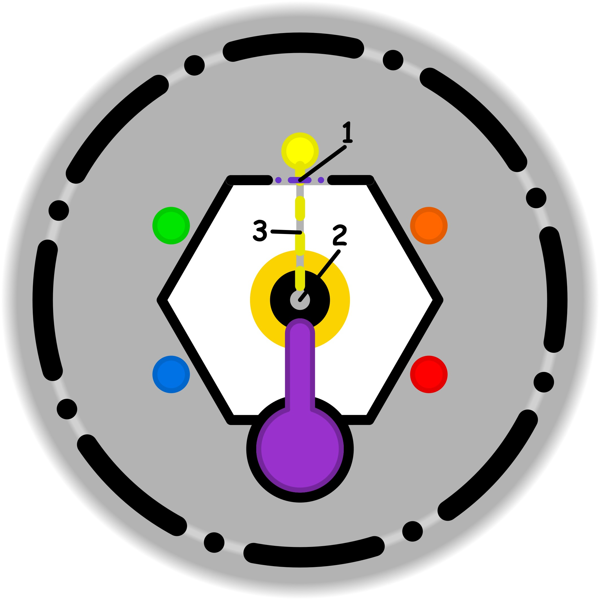

### CONCETTO CHIAVE: 
L'integrazione dell'ombra come atto di auto-autorizzazione per recuperare e armonizzare parti autentiche di sé, liberate dai filtri deformanti del giudizio sociale e dalle "regole fittizie".

### SPIEGAZIONE SIMBOLO:

#### 1. Trigger:
Il punto di partenza di questa dinamica è rappresentato da un disinteresse quasi impercettibile e inconsapevole che si manifesta sulla soglia etica dell'individuo. Questa condizione si traduce in un atteggiamento di sufficienza e superficialità, specialmente per quanto riguarda lo sviluppo e l'esercizio delle proprie abilità personali. Poiché tale stimolo è spesso invisibile e legato ad abitudini consolidate, tende a essere trascurato, portando il soggetto ad accettare passivamente ciò che proviene dall'ambiente esterno senza un reale coinvolgimento interiore.

#### 2. Situazione Disfunzionale: 
La fase problematica emerge quando l'individuo cade in uno stato di incertezza che lo spinge verso un conformismo acritico nei confronti dei modelli sociali circostanti. Si tende ad aderire a mode transitorie e a standard di comportamento medi solo per abitudine, rinunciando a mettere in discussione le influenze esterne. Questo adattamento avviene senza alcuna analisi profonda, portando la persona a comportarsi secondo la media di ciò che la circonda, ignorando le proprie necessità autentiche per fondersi in una realtà precostituita e impersonale.

#### 3. Conseguenze Emotive: 
Sul piano emotivo, si avverte una profonda sensazione di forzatura e condizionamento che genera un malessere diffuso, sebbene l'origine di tale disagio rimanga spesso ignota. L'individuo percepisce i propri gesti come una recita ostentata per conformarsi a pressioni esterne che non apprezza realmente. Si innesca così una dinamica circolare e nascosta, dove il senso di insoddisfazione per essere condizionati si autoalimenta, creando un problema strutturale di cui è difficile cogliere l'inizio proprio a causa della natura trascurata del trigger iniziale.