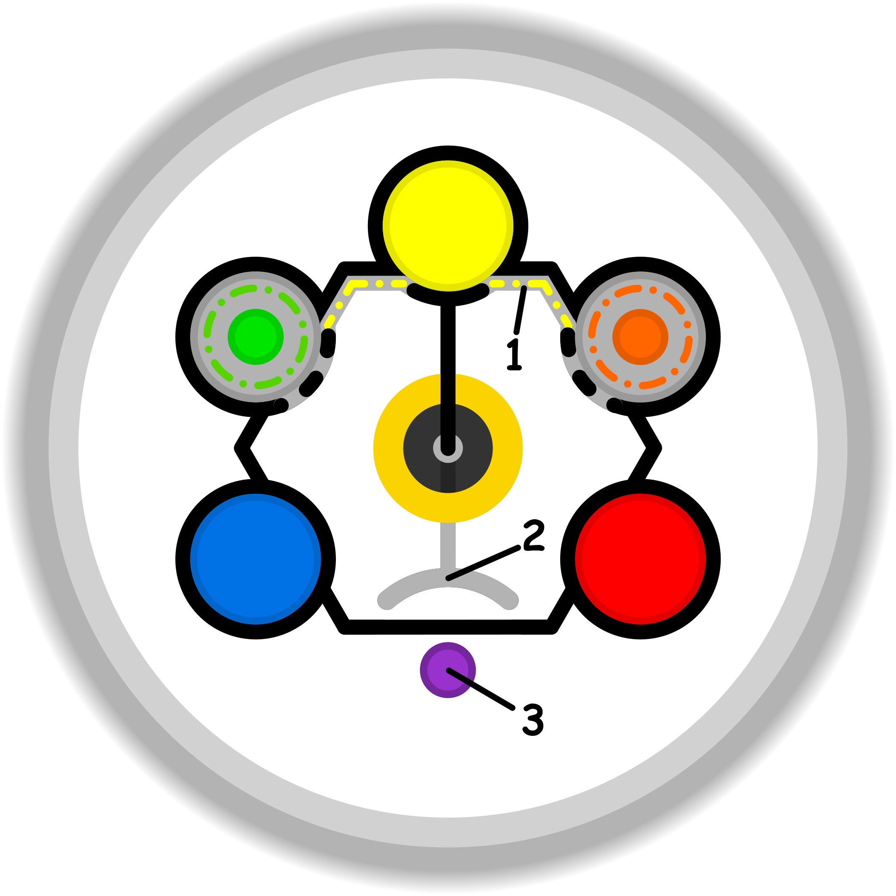

### CONCETTO CHIAVE: 
Evolvere il proprio modello significa spogliarsi delle convinzioni "zavorra" e delle "zone cieche" attraverso un confronto aperto con l'altro, trasformando una visione statica della realtà in una mappa dinamica, leggera e accurata.

### SPIEGAZIONE SIMBOLO:

#### 1. Trigger:
Il fattore scatenante risiede nel tentativo di agire al di fuori del proprio perimetro di competenze reali, spingendosi verso compiti per i quali non si possiede ancora la necessaria maestria. Questo impulso nasce spesso dal timore dell'emarginazione sociale e dal bisogno di sentirsi integrati in un determinato contesto o gruppo d'interesse. Si cerca di forzare una prestazione non dovuta o prematura, attivando un meccanismo di finzione in cui si ostenta una preparazione fittizia pur di non rischiare l'allontanamento dal gruppo di riferimento. È l'inizio di una rincorsa verso standard esterni che non corrispondono alla propria verità interiore né alle abilità attuali.

#### 2. Situazione Disfunzionale: 
La dinamica problematica si concretizza in una dissimulazione sistematica e spesso inconsapevole della propria inadeguatezza, dove si cerca di camuffare l'incapacità attraverso atteggiamenti di facciata. Invece di accogliere il limite come un'occasione di crescita o di interiorizzare l'informazione per evolvere, l'individuo sceglie di "glissare" e rifugiarsi in zone di comfort, nell'intrattenimento o in surrogati del gioco. Si crea così uno stato di profonda incertezza sull'immagine proiettata all'esterno; l'ostentazione di comportamenti artificiali diventa l'unico strumento per cercare una legittimazione, allontanandosi progressivamente dalla propria autenticità nel tentativo disperato di appartenere a qualcosa.

#### 3. Conseguenze Emotive: 
L'esito di questo processo è un doloroso sentimento di solitudine e di esclusione, poiché paradossalmente lo sforzo di apparire diversi finisce per allontanare proprio il gruppo che si desidera raggiungere, lasciando il soggetto in uno stato di abbandono. La persona sperimenta una profonda disillusione dovuta al fallimento delle aspettative e alla percezione di essere perennemente fuori posto. Questo disagio non trova una soluzione reale, ma alimenta una spirale viziosa: la paura di essere esclusi rende ancora più necessario fingere competenze non possedute, intrappolando l'individuo in una dinamica circolare che si autoalimenta e impedisce una vera maturazione.