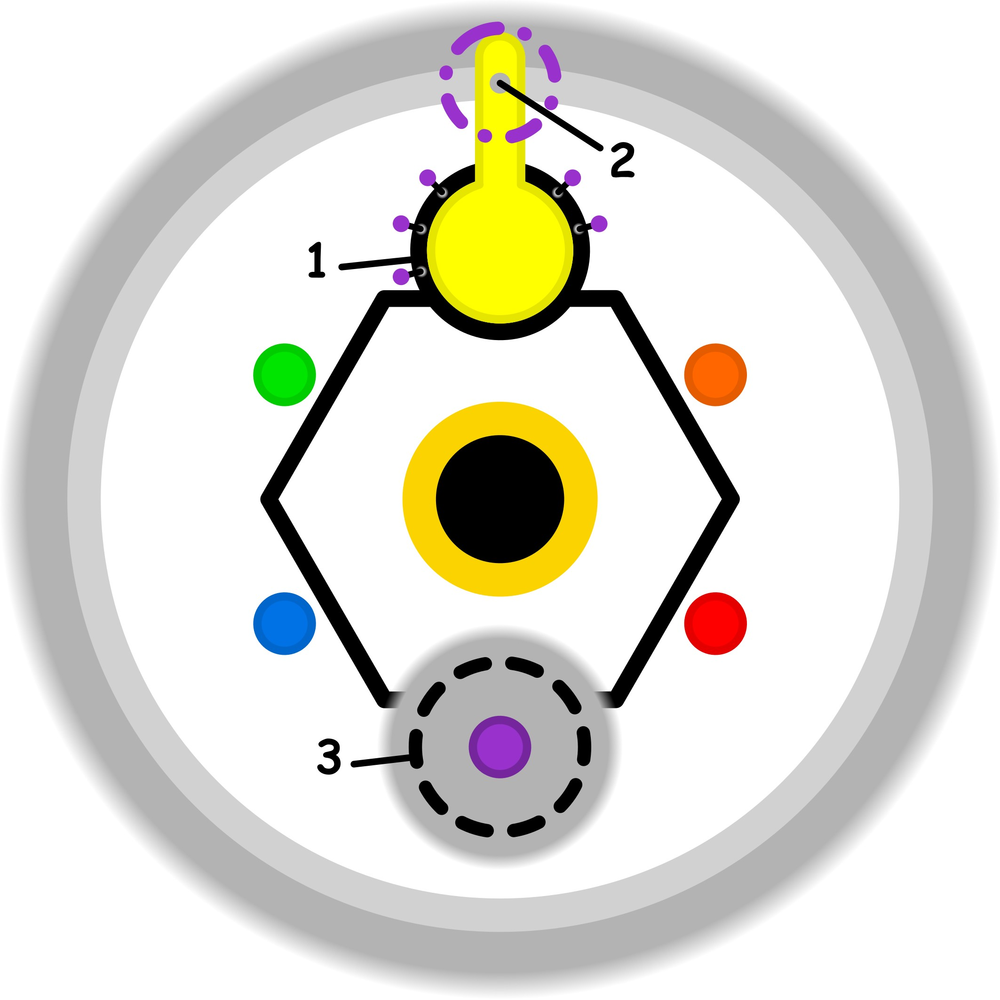

### CONCETTO CHIAVE: 
La disillusione costruttiva come atto di smantellamento di un ideale irraggiungibile per ricostruire, con i suoi stessi frammenti, una realtà concreta, accessibile e gratificante nella quotidianità.

### SPIEGAZIONE SIMBOLO:

#### 1. Trigger:
Il punto di partenza è un'esperienza di attrito interno che si manifesta nella dimensione delle proprie capacità pratiche e competenze. Si tratta di una forma di sensibilizzazione disturbante, definibile come una dissonanza cognitiva, in cui il soggetto percepisce chiaramente che qualcosa nel suo operato è fuori luogo o incoerente. Questo fastidio emerge in modo sottile, rendendo difficile l'identificazione immediata delle sue cause profonde, ma segnalando inequivocabilmente uno scollamento tra l'agire concreto e la percezione di armonia interna, creando così uno stato di allerta emotiva che colpisce direttamente la sfera delle abilità.

#### 2. Situazione Disfunzionale: 
La dinamica problematica si concretizza quando l'individuo, agendo a un livello di scarsa consapevolezza, finisce per oltrepassare i confini delle proprie reali abilità e dei limiti di ciò che sa effettivamente fare. In questa fase, il tentativo di mettere in pratica compiti che eccedono le proprie capacità provoca un brusco calo di interesse verso obiettivi che inizialmente sembravano stimolanti. Invece di affrontare questo divario tra le aspettative ideali e la realtà operativa, si attiva un meccanismo di adattamento passivo in cui il soggetto si abitua a ignorare il malessere e la dissonanza, rinunciando a una gestione consapevole della propria crescita.

#### 3. Conseguenze Emotive: 
A livello profondo, si genera un senso di incertezza che colpisce l'identità e la sfera spirituale, spingendo il soggetto verso una ricerca spasmodica di appartenenza esterna per giustificare l'incongruenza interiore. Si manifesta una forzatura psicologica nel voler aderire a gruppi o modelli di pensiero non verificati, cercando di allinearsi a essi solo per trovare una risonanza artificiale. Questo produce un conflitto interiore latente tra il proprio pensiero autentico e quello del gruppo di riferimento; la persona si ritrova a sopportare o nascondere tensioni emotive che non svaniscono, alimentando una dinamica circolare che si auto-genera e si manifesta periodicamente come un peso irrisolto.