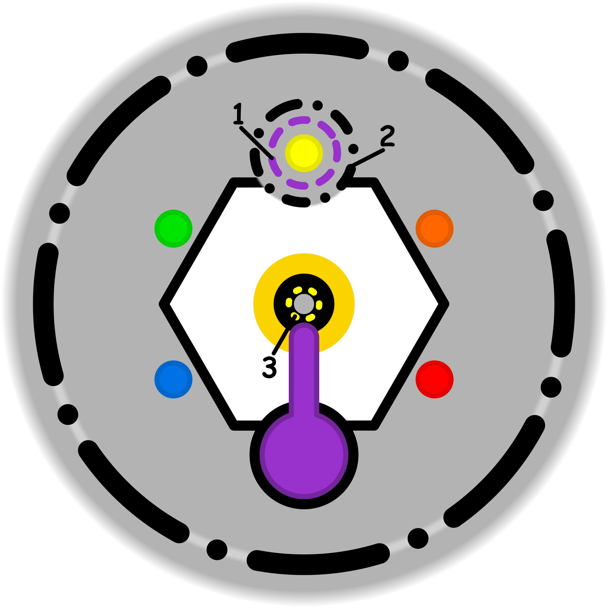

### CONCETTO CHIAVE: 
L'aggiornamento consapevole delle proprie "regole interiori" per eliminare le dissonanze cognitive e ripristinare l'armonia e il coinvolgimento nelle attività quotidiane.

### SPIEGAZIONE SIMBOLO:

#### 1. Trigger:
Il trigger si identifica nel momento in cui l'individuo avverte una forte pressione a dover appartenere necessariamente a un contesto specifico legato alle proprie attività abituali. Questa spinta si manifesta prevalentemente in ambiti dove viene richiesta una prestazione immediata, come il mondo del lavoro professionale o quello delle competizioni sportive. Non si tratta di un momento dedicato alla crescita o all'acquisizione di nuove conoscenze, ma di una situazione prettamente performativa in cui ci si sente obbligati a dimostrare il proprio valore e la propria integrazione all'interno di un gruppo o di un ambiente lavorativo definito.

#### 2. Situazione Disfunzionale: 
La dinamica problematica emerge quando l'individuo si trova ad agire su una soglia etica estremamente sottile e di cui non ha piena consapevolezza. In questa fase, pur percependo interiormente di non possedere le competenze necessarie per affrontare un determinato compito richiesto dal contesto performativo, si sente spinto dalla necessità di dissimulare la propria mancanza di capacità. Invece di riconoscere i propri limiti per superarli, si mette in atto una sorta di recita sociale finalizzata a nascondere l'incapacità del momento, creando uno scollamento tra ciò che si sa effettivamente fare e l'immagine di competenza che si cerca di proiettare.

#### 3. Conseguenze Emotive: 
Le ripercussioni emotive colpiscono il nucleo più profondo dell'identità personale, proprio dove solitamente dovrebbe risiedere la pazienza necessaria per un apprendimento graduale. Al posto della crescita naturale, si interiorizza l'obbligo di ostentare una sicurezza fittizia che spesso sfocia in atteggiamenti di superbia o supponenza. L'individuo tende a rimarcare eccessivamente le proprie abilità conosciute per distogliere l'attenzione dalle proprie lacune, vivendo nel costante sforzo di celare ciò che non sa fare. Questo meccanismo genera un senso di forzatura perenne, stabilizzando dinamiche disfunzionali che diventano croniche e impediscono un rapporto sano con il proprio sviluppo.