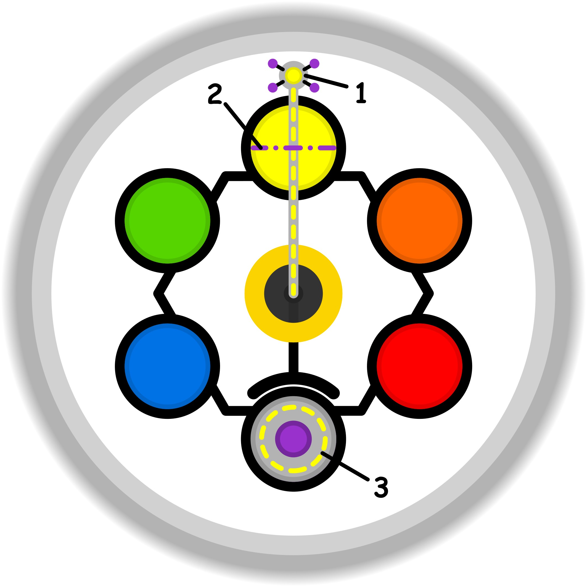

### CONCETTO CHIAVE: 
L'atto creativo e consapevole di trasformare ostacoli mentali apparentemente insormontabili in varchi verso nuove possibilità, attraverso la ridefinizione del proprio modello interiore e l'uso della consapevolezza come strumento di accesso.

### SIMBOLISMO: 
La scena ritrae un "Architetto dello Spirito" di fronte a un monolite di pietra grigia, immenso e senza fessure, che rappresenta i limiti e i muri della percezione. Invece di usare la forza, il personaggio utilizza un compasso di luce dorata per tracciare il profilo di una porta sulla superficie solida. Nel punto in cui il tratto tocca la pietra, questa perde consistenza, diventando trasparente come acqua o vetro, rivelando al di là un paesaggio rigoglioso e luminoso che rappresenta la "condizione ottimale" e il coinvolgimento positivo. Attorno al personaggio fluttuano frammenti di progetti e ingranaggi eterei, simboli del "modello" mentale che viene riorganizzato. Una volta tracciata, la porta inizia a emanare un calore dorato che dissolve la nebbia circostante, indicando che la consapevolezza acquisita rende l'ostacolo permanentemente superabile.
### PROMPT POSITIVO: 
anime-style illustration, high quality character artwork, detailed eyes, clean line art, cel shading, vibrant colors, professional character illustration, not photorealistic, 2D artwork, illustration, digital artwork, 2D art, stylized, drawn by an artist, not a photograph, not photorealistic, anime rendering,(masterpiece:1.2), (high quality), (ultra-detailed), a mystical architect of thoughts standing before a gargantuan and seamless grey stone monolith, the architect is drawing an ornate door outline on the cold stone using a glowing golden compass of light, where the light touches the stone it becomes translucent and liquid, revealing a sun-drenched vibrant valley with blooming flora inside the rock, (metaphor for shifting perspective), floating architectural blueprints made of stardust, ethereal glowing gears rotating in the air representing mental models, cinematic lighting, transition from cold blue mist to warm golden radiance, sharp focus on the translucent threshold, intricate stone textures, surrealism, high fantasy aesthetic, (illustrious style).
### PROMPT NEGATIVO: 
(low quality, worst quality:1.4), (bad anatomy), (distorted), literal iron keys, metal hammers, breaking the wall, violence, dark dungeon, prison cells, sadness, messy lines, blurry, flat lighting, text, watermark, signature, basic landscape, ordinary door, opaque stone, isolation, negative emotions.
### SPIEGAZIONE SIMBOLO:

#### 1. Trigger:
Il fattore scatenante si manifesta nel momento delicato dello scambio relazionale, situandosi precisamente sulla soglia etica del contatto con l'altro. Durante l'interazione sociale, emerge un senso di dissonanza cognitiva provocato da qualcosa che viene detto o percepito e che non risuona correttamente con la propria sensibilità interiore. Si avverte il desiderio di esprimere un disaccordo o una perplessità, oppure nasce un dubbio su ciò che gli altri stanno comunicando, ma ci si ritrova bloccati dall'incapacità tecnica o emotiva di gestire correttamente questa divergenza. Questo conflitto tra ciò che si avverte dentro e ciò che accade all'esterno segna l'inizio del processo.
#### 2. Situazione Disfunzionale: 
La situazione problematica si sviluppa attraverso un atteggiamento di disinteresse inconsapevole verso le radici profonde del proprio malessere e delle ragioni che hanno generato la dissonanza. Invece di indagare le cause del disagio, l'individuo mette in atto una forzatura psicologica che lo spinge a ostentare una sicurezza fittizia e una falsa approvazione anche di fronte a elementi che non gradisce. Si finisce per accettare passivamente situazioni sgradevoli, cercando di non dare a vedere il proprio disappunto, ma finendo inevitabilmente per somatizzare la tensione accumulata. Questo processo di occultamento impedisce di affrontare apertamente ciò che sta accadendo, preferendo una maschera di stabilità apparente alla risoluzione reale.
#### 3. Conseguenze Emotive: 
Le ricadute emotive investono la sfera più profonda dello spirito, generando un clima di incertezza e instabilità riguardo al proprio modello interiore. Il soggetto si ritrova influenzato da regole puramente superficiali e apparenti che impongono una forzatura costante: ci si costringe ad accettare come positivo ciò che è chiaramente dissonante pur di non rompere il silenzio o le abitudini consolidate di non esporsi. Il risultato finale è una paralisi comunicativa caratterizzata dall'incapacità generalizzata di manifestare le proprie opinioni in modo autentico, spontaneo e genuino. Si rinuncia così alla possibilità di chiarirsi o di esporre ciò che mette in difficoltà, compromettendo la propria integrità espressiva.